# macpad++ 設計文件（Design Document）

> **版本**：1.0.0　**日期**：2026-07-07　**對應程式碼**：commit `17f10cc` 之後
> **範圍**：完整架構級設計說明 —— 系統概觀、分層職責、元件依賴、類別圖、主要功能時序圖、功能流程分析與關鍵設計決策。
> **對象**：後續維護者、貢獻者、想理解整體結構的讀者。
> 所有圖表以 Mermaid 繪製（遵循團隊憲法 §12：禁止外部圖片）。

---

## 目錄

1. [系統概觀](#1-系統概觀)
2. [架構總覽](#2-架構總覽)
3. [元件依賴圖（Component Diagram）](#3-元件依賴圖component-diagram)
4. [分層職責](#4-分層職責)
5. [核心資料流](#5-核心資料流)
6. [類別圖（Class Diagrams）](#6-類別圖class-diagrams)
7. [主要功能時序圖（Sequence Diagrams）](#7-主要功能時序圖sequence-diagrams)
8. [功能流程分析](#8-功能流程分析)
9. [關鍵設計決策](#9-關鍵設計決策)
10. [品質與測試](#10-品質與測試)
11. [附錄：目錄結構](#11-附錄目錄結構)

---

## 1. 系統概觀

**macpad++** 是一款原生 macOS 的文字/程式碼編輯器，目標是把 Notepad++ 的功能在 Mac 上對等複刻。

| 面向 | 內容 |
|------|------|
| **語言/標準** | C++17 |
| **GUI 框架** | Qt6 Widgets |
| **編輯核心** | QScintilla（`QsciScintilla` / `QsciLexer` / `QsciLexerCustom` / `QsciMacro`） |
| **建置** | CMake（out-of-source 強制）、AUTOMOC/AUTORCC/AUTOUIC |
| **傳統編碼** | Qt6 Core5Compat（`QTextCodec`，Big5 / GBK / Shift-JIS…） |
| **外掛預覽** | Qt6 WebEngineWidgets（Markdown + Mermaid 離線渲染） |
| **圖示** | Qt6 Svg（`QSvgRenderer`，隨主題變色的單色工具列圖示） |
| **相依定位** | Homebrew：`qt`、`qscintilla2` |

**設計原則**：單機、無後端、無網路、無資料庫；核心邏輯與 GUI 分離以利單元測試；所有使用者資料以原子寫入的 JSON 存於 `~/Library/Application Support/macpad++/`。

**非目標（Non-Goals）**：載入 Notepad++ 的 Windows `.dll` 二進位外掛（平台限制，改以 in-process extension protocol 取代）；跨平台（雖然大部分程式碼可攜，但明確以 macOS 為交付目標）。

---

## 2. 架構總覽

### 2.1 分層架構

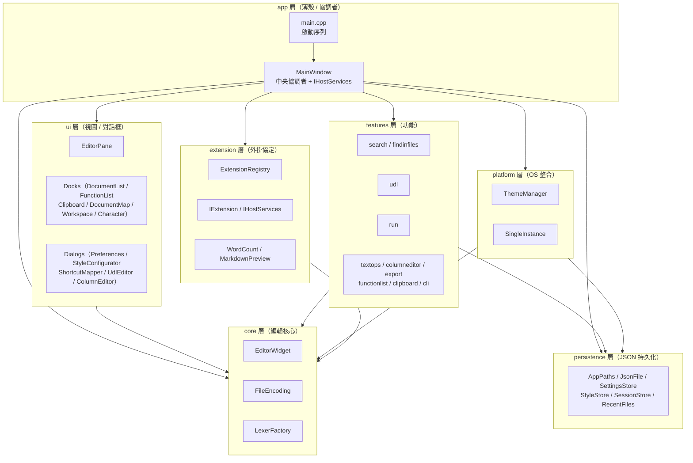
```mermaid
flowchart TB
    subgraph app["app 層（薄殼 / 協調者）"]
        main["main.cpp\n啟動序列"]
        MW["MainWindow\n中央協調者 + IHostServices"]
    end
    subgraph core["core 層（編輯核心）"]
        EW["EditorWidget"]
        FE["FileEncoding"]
        LF["LexerFactory"]
    end
    subgraph features["features 層（功能）"]
        SR["search / findinfiles"]
        UDL["udl"]
        RUN["run"]
        MISC["textops / columneditor / export\nfunctionlist / clipboard / cli"]
    end
    subgraph ui["ui 層（視圖 / 對話框）"]
        PANE["EditorPane"]
        DOCKS["Docks（DocumentList / FunctionList\nClipboard / DocumentMap / Workspace / Character）"]
        DLGS["Dialogs（Preferences / StyleConfigurator\nShortcutMapper / UdlEditor / ColumnEditor）"]
    end
    subgraph persistence["persistence 層（JSON 持久化）"]
        STORES["AppPaths / JsonFile / SettingsStore\nStyleStore / SessionStore / RecentFiles"]
    end
    subgraph platform["platform 層（OS 整合）"]
        TM["ThemeManager"]
        SI["SingleInstance"]
    end
    subgraph extension["extension 層（外掛協定）"]
        REG["ExtensionRegistry"]
        IEXT["IExtension / IHostServices"]
        BUILTIN["WordCount / MarkdownPreview"]
    end

    main --> MW
    MW --> core
    MW --> features
    MW --> ui
    MW --> persistence
    MW --> platform
    MW --> extension
    ui --> core
    features --> core
    features --> persistence
    platform --> core
    platform --> persistence
    extension --> core
```

### 2.2 建置形狀：靜態庫 + 薄殼

所有 `src/**` 原始碼編為單一靜態庫 **`macpad_lib`**；可執行檔 **`macpad++`**（macOS bundle）僅含 `app/main.cpp` 並連結 `macpad_lib`。單元測試同樣連結 `macpad_lib` + `Qt6::Test`，因此能直接測試核心邏輯而不必啟動 GUI。

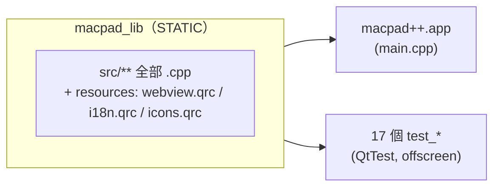
```mermaid
flowchart LR
    subgraph lib["macpad_lib（STATIC）"]
        srcs["src/** 全部 .cpp\n+ resources: webview.qrc / i18n.qrc / icons.qrc"]
    end
    exe["macpad++.app\n(main.cpp)"]
    tests["17 個 test_*\n(QtTest, offscreen)"]
    lib --> exe
    lib --> tests
```

> **靜態庫中的 Qt Resource（.qrc）**必須以 `Q_INIT_RESOURCE(<qrc-basename>)` 明確初始化，否則連結器會剝除；且該呼叫需置於**全域命名空間**（`i18n`/`icons` 在 `main.cpp`/`MainWindow::buildToolbar` 呼叫，`webview` 在外掛以全域 helper 呼叫）。

---

## 3. 元件依賴圖（Component Diagram）

以模組為節點，箭頭表示「編譯期/呼叫依賴」。可見依賴方向乾淨地由外層指向內層（`core` 不反向依賴任何上層）。

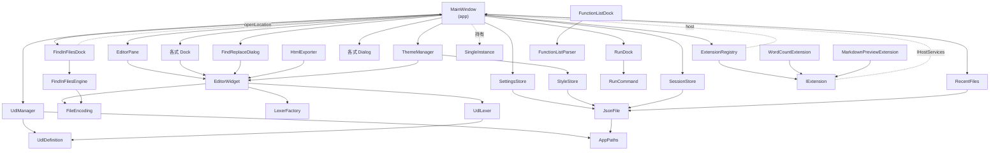
```mermaid
flowchart TB
    MW["MainWindow\n(app)"]

    MW --> EditorPane
    MW --> ExtensionRegistry
    MW --> FindReplaceDialog
    MW --> FindInFilesDock
    MW --> RunDock
    MW --> Docks["各式 Dock"]
    MW --> Dialogs["各式 Dialog"]
    MW --> UdlManager
    MW --> SettingsStore
    MW --> SessionStore
    MW --> RecentFiles
    MW --> ThemeManager
    MW -.持有.-> SingleInstance

    EditorPane --> EditorWidget
    Docks --> EditorWidget
    FindReplaceDialog --> EditorWidget
    FindInFilesDock --> FindInFilesEngine
    FindInFilesDock -. openLocation .-> MW
    RunDock --> RunCommand

    EditorWidget --> FileEncoding
    EditorWidget --> LexerFactory
    EditorWidget --> UdlLexer

    UdlManager --> UdlDefinition
    UdlLexer --> UdlDefinition
    UdlManager --> AppPaths

    FindInFilesEngine --> FileEncoding
    HtmlExporter --> EditorWidget
    FunctionListDock --> FunctionListParser

    ThemeManager --> StyleStore
    ThemeManager --> EditorWidget

    SettingsStore --> JsonFile
    StyleStore --> JsonFile
    SessionStore --> JsonFile
    RecentFiles --> JsonFile
    JsonFile --> AppPaths

    ExtensionRegistry --> IExtension
    ExtensionRegistry -. host .-> MW
    IExtension -. IHostServices .-> MW
    WordCountExtension --> IExtension
    MarkdownPreviewExtension --> IExtension
```

---

## 4. 分層職責

| 層 | 命名空間 | 職責 | 是否 GUI |
|----|---------|------|:---:|
| **app** | （全域）`MainWindow` | 啟動序列、中央協調、選單/工具列/狀態列/Dock 組裝、signal 佈線、擔任外掛宿主 | ✅ |
| **core** | `macpad::core` | 編輯核心：`EditorWidget`（Scintilla 封裝、檔案 I/O、編碼/EOL、書籤、折疊、call-tip）、`FileEncoding`（偵測/編解碼）、`LexerFactory`（副檔名→lexer） | 部分 |
| **features** | `macpad::features` | 純邏輯功能單元：搜尋、Find-in-Files、UDL、Run、文字操作、欄位編輯、HTML 匯出、函式清單、剪貼簿歷史、CLI 解析 | 少數 |
| **ui** | `macpad::ui` | 視圖與對話框：`EditorPane`（分割）、各式 Dock、各式 Dialog | ✅ |
| **persistence** | `macpad::persistence` | JSON 持久化：`AppPaths`、`JsonFile`（原子寫入）、`SettingsStore`、`StyleStore`、`SessionStore`、`RecentFiles` | ❌ |
| **platform** | `macpad::platform` | OS 整合：`ThemeManager`（深淺色 + 顏色柔化）、`SingleInstance`（單一實例 IPC） | ❌ |
| **extension** | `macpad::extension` | 外掛協定 `IExtension`/`IHostServices`、`ExtensionRegistry`、內建外掛 | 部分 |

**可測試性設計**：persistence / platform / 大部分 features 皆為**無狀態 static 函式類別**或純資料 struct，不需 GUI 即可單元測試；`EditorWidget` 因繼承 `QsciScintilla`，測試在 `QT_QPA_PLATFORM=offscreen` 下實體化。

---

## 5. 核心資料流

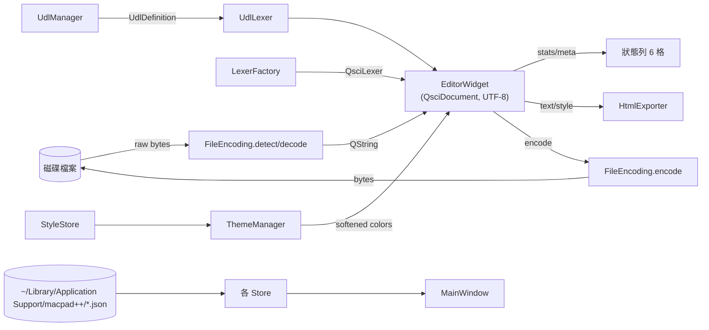
```mermaid
flowchart LR
    disk[("磁碟檔案")] -->|raw bytes| FE["FileEncoding.detect/decode"]
    FE -->|QString| EW["EditorWidget\n(QsciDocument, UTF-8)"]
    LF["LexerFactory"] -->|QsciLexer| EW
    UDLM["UdlManager"] -->|UdlDefinition| UDLL["UdlLexer"] --> EW
    EW -->|stats/meta| SB["狀態列 6 格"]
    EW -->|text/style| HE["HtmlExporter"]
    EW -->|encode| FE2["FileEncoding.encode"] -->|bytes| disk
    TM["ThemeManager"] -->|softened colors| EW
    SS["StyleStore"] --> TM
    cfg[("~/Library/Application Support/macpad++/*.json")] --> stores["各 Store"] --> MW["MainWindow"]
```

**要點**：
- `EditorWidget` 內部一律 UTF-8（`setUtf8(true)`），因此 Scintilla 的位置皆為 **byte offset**。
- 載入時偵測結果（`Encoding`/`Eol`）存於編輯器；若使用者以傳統編碼重新解讀，則設定 `m_codecName`，存檔時改走 `encodeWithCodec`。
- 語法顏色不由 lexer 直接決定：`ThemeManager` 對每個 style 的顏色做 HSL 柔化，再疊上 `StyleStore` 的使用者覆寫。

---

## 6. 類別圖（Class Diagrams）

> 為可讀性，依層拆成數張。方法簽章經簡化（省略部分參數/const）。

### 6.1 app + core

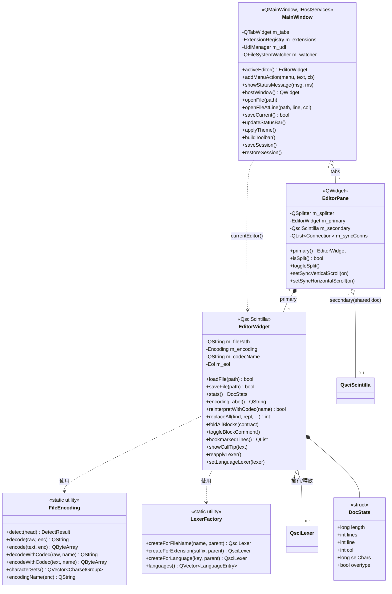
```mermaid
classDiagram
    class MainWindow {
        <<QMainWindow, IHostServices>>
        -QTabWidget m_tabs
        -ExtensionRegistry m_extensions
        -UdlManager m_udl
        -QFileSystemWatcher m_watcher
        +activeEditor() EditorWidget
        +addMenuAction(menu, text, cb)
        +showStatusMessage(msg, ms)
        +hostWindow() QWidget
        +openFile(path)
        +openFileAtLine(path, line, col)
        +saveCurrent() bool
        +updateStatusBar()
        +applyTheme()
        +buildToolbar()
        +saveSession()
        +restoreSession()
    }
    class EditorPane {
        <<QWidget>>
        -QSplitter m_splitter
        -EditorWidget m_primary
        -QsciScintilla m_secondary
        -QList~Connection~ m_syncConns
        +primary() EditorWidget
        +isSplit() bool
        +toggleSplit()
        +setSyncVerticalScroll(on)
        +setSyncHorizontalScroll(on)
    }
    class EditorWidget {
        <<QsciScintilla>>
        -QString m_filePath
        -Encoding m_encoding
        -QString m_codecName
        -Eol m_eol
        +loadFile(path) bool
        +saveFile(path) bool
        +stats() DocStats
        +encodingLabel() QString
        +reinterpretWithCodec(name) bool
        +replaceAll(find, repl, ...) int
        +foldAllBlocks(contract)
        +toggleBlockComment()
        +bookmarkedLines() QList
        +showCallTip(text)
        +reapplyLexer()
        +setLanguageLexer(lexer)
    }
    class DocStats {
        <<struct>>
        +long length
        +int lines
        +int line
        +int col
        +long selChars
        +bool overtype
    }
    class FileEncoding {
        <<static utility>>
        +detect(head) DetectResult
        +decode(raw, enc) QString
        +encode(text, enc) QByteArray
        +decodeWithCodec(raw, name) QString
        +encodeWithCodec(text, name) QByteArray
        +characterSets() QVector~CharsetGroup~
        +encodingName(enc) QString
    }
    class LexerFactory {
        <<static utility>>
        +createForFileName(name, parent) QsciLexer
        +createForExtension(suffix, parent) QsciLexer
        +createForLanguage(key, parent) QsciLexer
        +languages() QVector~LanguageEntry~
    }

    MainWindow "1" o-- "*" EditorPane : tabs
    EditorPane "1" *-- "1" EditorWidget : primary
    EditorPane "1" o-- "0..1" QsciScintilla : secondary(shared doc)
    EditorWidget ..> FileEncoding : 使用
    EditorWidget ..> LexerFactory : 使用
    EditorWidget "1" o-- "0..1" QsciLexer : 擁有/釋放
    EditorWidget *-- DocStats
    MainWindow ..> EditorWidget : currentEditor()
```

### 6.2 features：搜尋 / Find-in-Files / UDL / Run

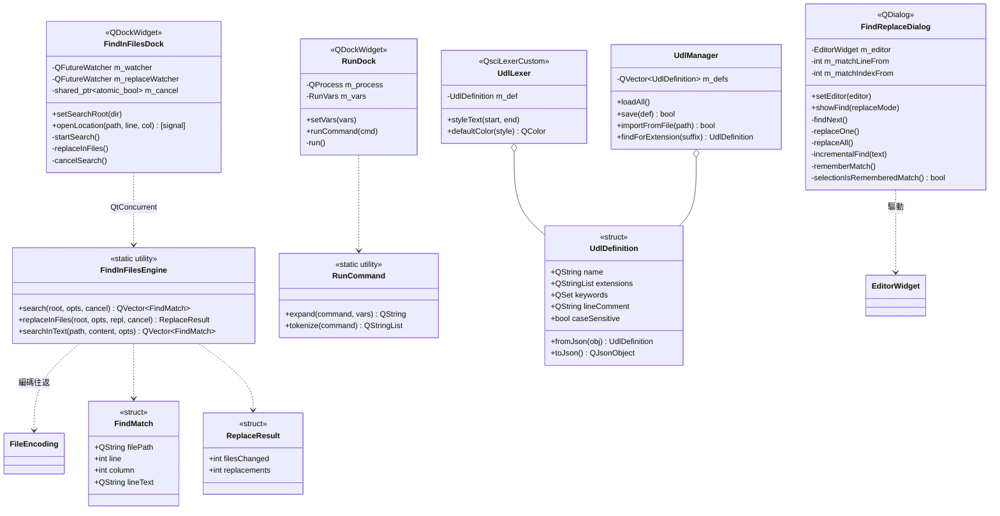
```mermaid
classDiagram
    class FindReplaceDialog {
        <<QDialog>>
        -EditorWidget m_editor
        -int m_matchLineFrom
        -int m_matchIndexFrom
        +setEditor(editor)
        +showFind(replaceMode)
        -findNext()
        -replaceOne()
        -replaceAll()
        -incrementalFind(text)
        -rememberMatch()
        -selectionIsRememberedMatch() bool
    }
    class FindInFilesEngine {
        <<static utility>>
        +search(root, opts, cancel) QVector~FindMatch~
        +replaceInFiles(root, opts, repl, cancel) ReplaceResult
        +searchInText(path, content, opts) QVector~FindMatch~
    }
    class FindMatch {
        <<struct>>
        +QString filePath
        +int line
        +int column
        +QString lineText
    }
    class ReplaceResult {
        <<struct>>
        +int filesChanged
        +int replacements
    }
    class FindInFilesDock {
        <<QDockWidget>>
        -QFutureWatcher m_watcher
        -QFutureWatcher m_replaceWatcher
        -shared_ptr~atomic_bool~ m_cancel
        +setSearchRoot(dir)
        +openLocation(path, line, col) [signal]
        -startSearch()
        -replaceInFiles()
        -cancelSearch()
    }
    class RunCommand {
        <<static utility>>
        +expand(command, vars) QString
        +tokenize(command) QStringList
    }
    class RunDock {
        <<QDockWidget>>
        -QProcess m_process
        -RunVars m_vars
        +setVars(vars)
        +runCommand(cmd)
        -run()
    }
    class UdlDefinition {
        <<struct>>
        +QString name
        +QStringList extensions
        +QSet keywords
        +QString lineComment
        +bool caseSensitive
        +fromJson(obj) UdlDefinition
        +toJson() QJsonObject
    }
    class UdlLexer {
        <<QsciLexerCustom>>
        -UdlDefinition m_def
        +styleText(start, end)
        +defaultColor(style) QColor
    }
    class UdlManager {
        -QVector~UdlDefinition~ m_defs
        +loadAll()
        +save(def) bool
        +importFromFile(path) bool
        +findForExtension(suffix) UdlDefinition
    }

    FindReplaceDialog ..> EditorWidget : 驅動
    FindInFilesDock ..> FindInFilesEngine : QtConcurrent
    FindInFilesEngine ..> FileEncoding : 編碼往返
    FindInFilesEngine ..> FindMatch
    FindInFilesEngine ..> ReplaceResult
    RunDock ..> RunCommand
    UdlLexer o-- UdlDefinition
    UdlManager o-- UdlDefinition
```

### 6.3 features：純函式工具（無 GUI）

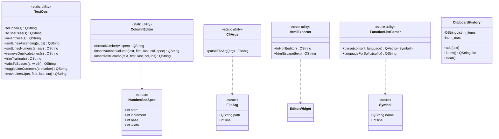
```mermaid
classDiagram
    class TextOps {
        <<static utility>>
        +toUpper(s) QString
        +toTitleCase(s) QString
        +invertCase(s) QString
        +sortLinesAscending(s, cs) QString
        +sortLinesNumeric(s, asc) QString
        +removeDuplicateLines(s) QString
        +trimTrailing(s) QString
        +tabsToSpaces(s, width) QString
        +toggleLineComment(s, marker) QString
        +moveLinesUp(s, first, last, out) QString
    }
    class ColumnEditor {
        <<static utility>>
        +formatNumber(v, spec) QString
        +insertNumberColumn(text, first, last, col, spec) QString
        +insertTextColumn(text, first, last, col, ins) QString
    }
    class NumberSeqSpec {
        <<struct>>
        +int start
        +int increment
        +int base
        +int width
    }
    class CliArgs {
        <<static utility>>
        +parseFileArg(arg) FileArg
    }
    class FileArg {
        <<struct>>
        +QString path
        +int line
    }
    class HtmlExporter {
        <<static utility>>
        +toHtml(editor) QString
        +htmlEscape(text) QString
    }
    class FunctionListParser {
        <<static utility>>
        +parse(content, language) QVector~Symbol~
        +languageForSuffix(suffix) QString
    }
    class Symbol {
        <<struct>>
        +QString name
        +int line
    }
    class ClipboardHistory {
        -QStringList m_items
        -int m_max
        +add(text)
        +items() QStringList
        +clear()
    }
    ColumnEditor ..> NumberSeqSpec
    CliArgs ..> FileArg
    FunctionListParser ..> Symbol
    HtmlExporter ..> EditorWidget
```

### 6.4 persistence + platform

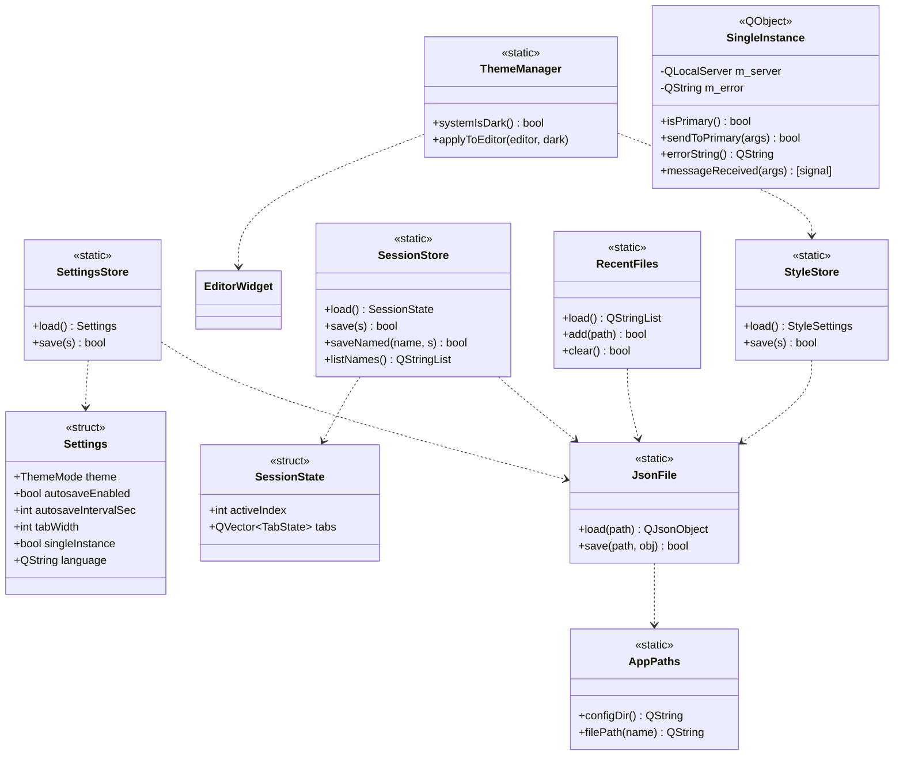
```mermaid
classDiagram
    class AppPaths {
        <<static>>
        +configDir() QString
        +filePath(name) QString
    }
    class JsonFile {
        <<static>>
        +load(path) QJsonObject
        +save(path, obj) bool
    }
    class SettingsStore {
        <<static>>
        +load() Settings
        +save(s) bool
    }
    class Settings {
        <<struct>>
        +ThemeMode theme
        +bool autosaveEnabled
        +int autosaveIntervalSec
        +int tabWidth
        +bool singleInstance
        +QString language
    }
    class StyleStore {
        <<static>>
        +load() StyleSettings
        +save(s) bool
    }
    class SessionStore {
        <<static>>
        +load() SessionState
        +save(s) bool
        +saveNamed(name, s) bool
        +listNames() QStringList
    }
    class SessionState {
        <<struct>>
        +int activeIndex
        +QVector~TabState~ tabs
    }
    class RecentFiles {
        <<static>>
        +load() QStringList
        +add(path) bool
        +clear() bool
    }
    class ThemeManager {
        <<static>>
        +systemIsDark() bool
        +applyToEditor(editor, dark)
    }
    class SingleInstance {
        <<QObject>>
        -QLocalServer m_server
        -QString m_error
        +isPrimary() bool
        +sendToPrimary(args) bool
        +errorString() QString
        +messageReceived(args) [signal]
    }

    SettingsStore ..> JsonFile
    StyleStore ..> JsonFile
    SessionStore ..> JsonFile
    RecentFiles ..> JsonFile
    JsonFile ..> AppPaths
    SettingsStore ..> Settings
    SessionStore ..> SessionState
    ThemeManager ..> StyleStore
    ThemeManager ..> EditorWidget
```

### 6.5 extension 協定

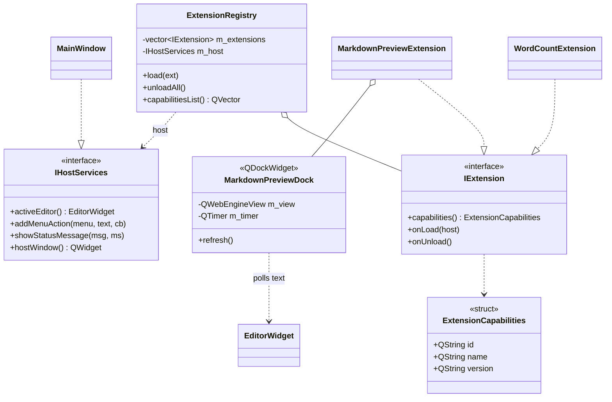
```mermaid
classDiagram
    class IHostServices {
        <<interface>>
        +activeEditor() EditorWidget
        +addMenuAction(menu, text, cb)
        +showStatusMessage(msg, ms)
        +hostWindow() QWidget
    }
    class IExtension {
        <<interface>>
        +capabilities() ExtensionCapabilities
        +onLoad(host)
        +onUnload()
    }
    class ExtensionCapabilities {
        <<struct>>
        +QString id
        +QString name
        +QString version
    }
    class ExtensionRegistry {
        -vector~IExtension~ m_extensions
        -IHostServices m_host
        +load(ext)
        +unloadAll()
        +capabilitiesList() QVector
    }
    class MainWindow
    class WordCountExtension
    class MarkdownPreviewExtension
    class MarkdownPreviewDock {
        <<QDockWidget>>
        -QWebEngineView m_view
        -QTimer m_timer
        +refresh()
    }

    MainWindow ..|> IHostServices
    WordCountExtension ..|> IExtension
    MarkdownPreviewExtension ..|> IExtension
    ExtensionRegistry o-- IExtension
    ExtensionRegistry ..> IHostServices : host
    IExtension ..> ExtensionCapabilities
    MarkdownPreviewExtension o-- MarkdownPreviewDock
    MarkdownPreviewDock ..> EditorWidget : polls text
```

### 6.6 ui：Dock 與 MainWindow 的 signal 回饋

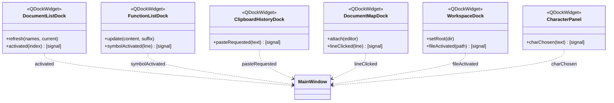
```mermaid
classDiagram
    class MainWindow
    class DocumentListDock {
        <<QDockWidget>>
        +refresh(names, current)
        +activated(index) [signal]
    }
    class FunctionListDock {
        <<QDockWidget>>
        +update(content, suffix)
        +symbolActivated(line) [signal]
    }
    class ClipboardHistoryDock {
        <<QDockWidget>>
        +pasteRequested(text) [signal]
    }
    class DocumentMapDock {
        <<QDockWidget>>
        +attach(editor)
        +lineClicked(line) [signal]
    }
    class WorkspaceDock {
        <<QDockWidget>>
        +setRoot(dir)
        +fileActivated(path) [signal]
    }
    class CharacterPanel {
        <<QDockWidget>>
        +charChosen(text) [signal]
    }
    DocumentListDock ..> MainWindow : activated
    FunctionListDock ..> MainWindow : symbolActivated
    ClipboardHistoryDock ..> MainWindow : pasteRequested
    DocumentMapDock ..> MainWindow : lineClicked
    WorkspaceDock ..> MainWindow : fileActivated
    CharacterPanel ..> MainWindow : charChosen
```

---

## 7. 主要功能時序圖（Sequence Diagrams）

### 7.1 開檔 + 編碼偵測 + Lexer 套用

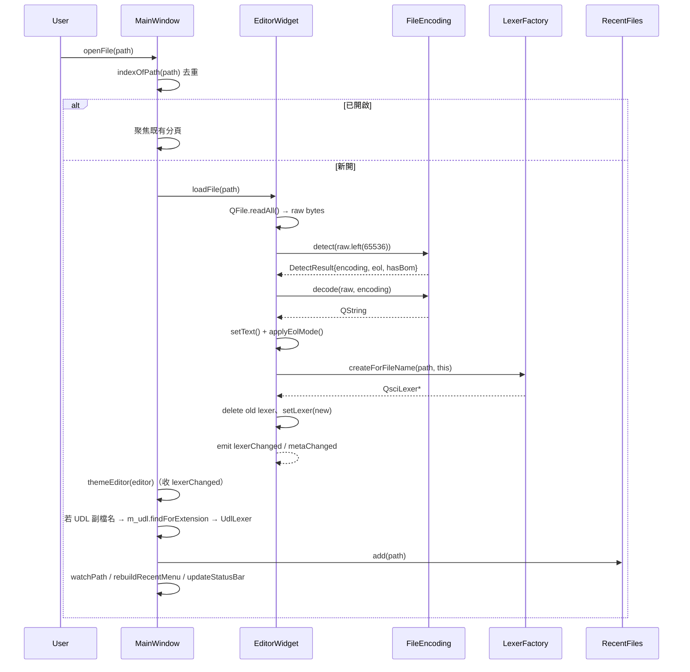
```mermaid
sequenceDiagram
    participant User
    participant MW as MainWindow
    participant EW as EditorWidget
    participant FE as FileEncoding
    participant LF as LexerFactory
    participant RF as RecentFiles

    User->>MW: openFile(path)
    MW->>MW: indexOfPath(path) 去重
    alt 已開啟
        MW->>MW: 聚焦既有分頁
    else 新開
        MW->>EW: loadFile(path)
        EW->>EW: QFile.readAll() → raw bytes
        EW->>FE: detect(raw.left(65536))
        FE-->>EW: DetectResult{encoding, eol, hasBom}
        EW->>FE: decode(raw, encoding)
        FE-->>EW: QString
        EW->>EW: setText() + applyEolMode()
        EW->>LF: createForFileName(path, this)
        LF-->>EW: QsciLexer*
        EW->>EW: delete old lexer、setLexer(new)
        EW-->>EW: emit lexerChanged / metaChanged
        MW->>MW: themeEditor(editor)（收 lexerChanged）
        MW->>MW: 若 UDL 副檔名 → m_udl.findForExtension → UdlLexer
        MW->>RF: add(path)
        MW->>MW: watchPath / rebuildRecentMenu / updateStatusBar
    end
```

### 7.2 存檔（含傳統編碼）

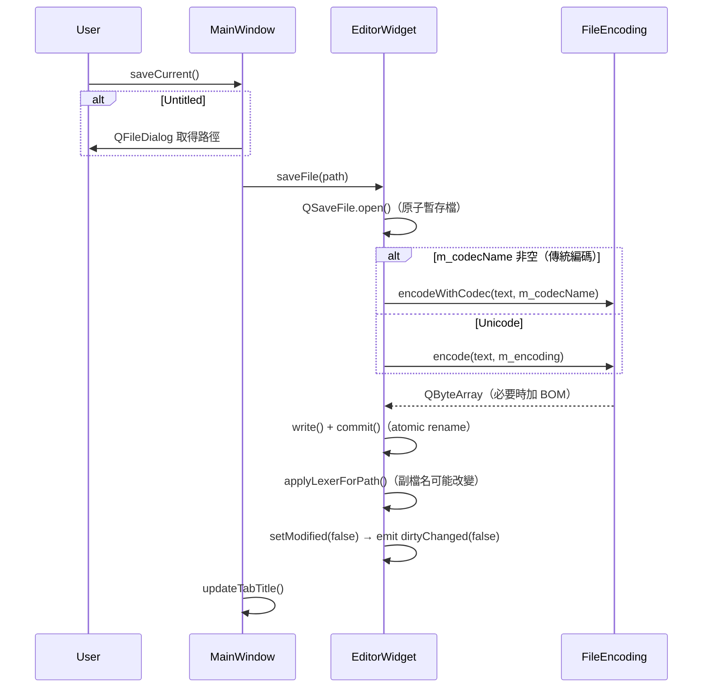
```mermaid
sequenceDiagram
    participant User
    participant MW as MainWindow
    participant EW as EditorWidget
    participant FE as FileEncoding

    User->>MW: saveCurrent()
    alt Untitled
        MW->>User: QFileDialog 取得路徑
    end
    MW->>EW: saveFile(path)
    EW->>EW: QSaveFile.open()（原子暫存檔）
    alt m_codecName 非空（傳統編碼）
        EW->>FE: encodeWithCodec(text, m_codecName)
    else Unicode
        EW->>FE: encode(text, m_encoding)
    end
    FE-->>EW: QByteArray（必要時加 BOM）
    EW->>EW: write() + commit()（atomic rename）
    EW->>EW: applyLexerForPath()（副檔名可能改變）
    EW->>EW: setModified(false) → emit dirtyChanged(false)
    MW->>MW: updateTabTitle()
```

### 7.3 搜尋：Replace One 守衛 + Find in Files 背景執行

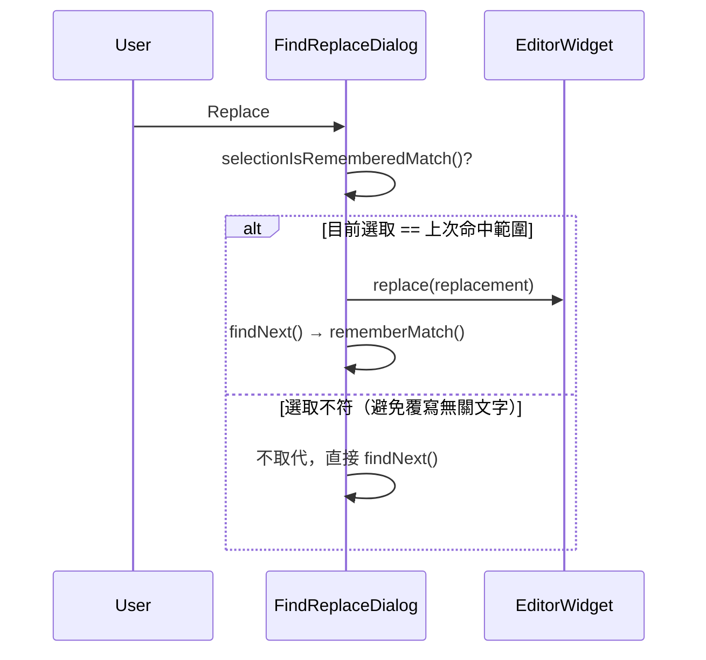
```mermaid
sequenceDiagram
    participant User
    participant FRD as FindReplaceDialog
    participant EW as EditorWidget

    User->>FRD: Replace
    FRD->>FRD: selectionIsRememberedMatch()?
    alt 目前選取 == 上次命中範圍
        FRD->>EW: replace(replacement)
        FRD->>FRD: findNext() → rememberMatch()
    else 選取不符（避免覆寫無關文字）
        FRD->>FRD: 不取代，直接 findNext()
    end
```

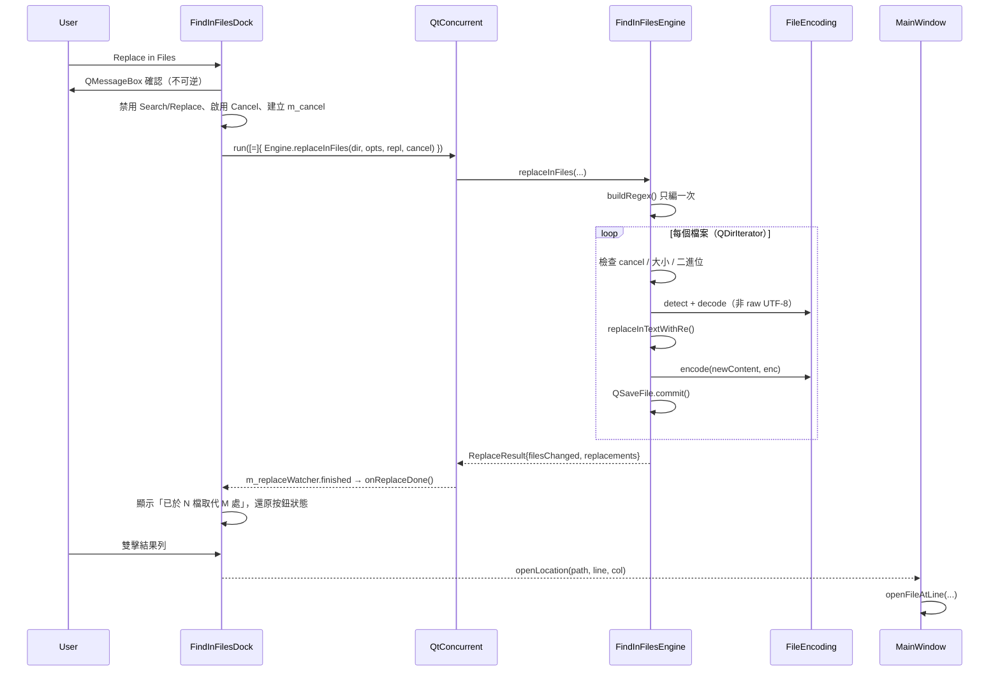
```mermaid
sequenceDiagram
    participant User
    participant Dock as FindInFilesDock
    participant QC as QtConcurrent
    participant Eng as FindInFilesEngine
    participant FE as FileEncoding
    participant MW as MainWindow

    User->>Dock: Replace in Files
    Dock->>User: QMessageBox 確認（不可逆）
    Dock->>Dock: 禁用 Search/Replace、啟用 Cancel、建立 m_cancel
    Dock->>QC: run([=]{ Engine.replaceInFiles(dir, opts, repl, cancel) })
    QC->>Eng: replaceInFiles(...)
    Eng->>Eng: buildRegex() 只編一次
    loop 每個檔案（QDirIterator）
        Eng->>Eng: 檢查 cancel / 大小 / 二進位
        Eng->>FE: detect + decode（非 raw UTF-8）
        Eng->>Eng: replaceInTextWithRe()
        Eng->>FE: encode(newContent, enc)
        Eng->>Eng: QSaveFile.commit()
    end
    Eng-->>QC: ReplaceResult{filesChanged, replacements}
    QC-->>Dock: m_replaceWatcher.finished → onReplaceDone()
    Dock->>Dock: 顯示「已於 N 檔取代 M 處」，還原按鈕狀態
    User->>Dock: 雙擊結果列
    Dock-->>MW: openLocation(path, line, col)
    MW->>MW: openFileAtLine(...)
```

### 7.4 擴充載入與 Markdown 即時預覽

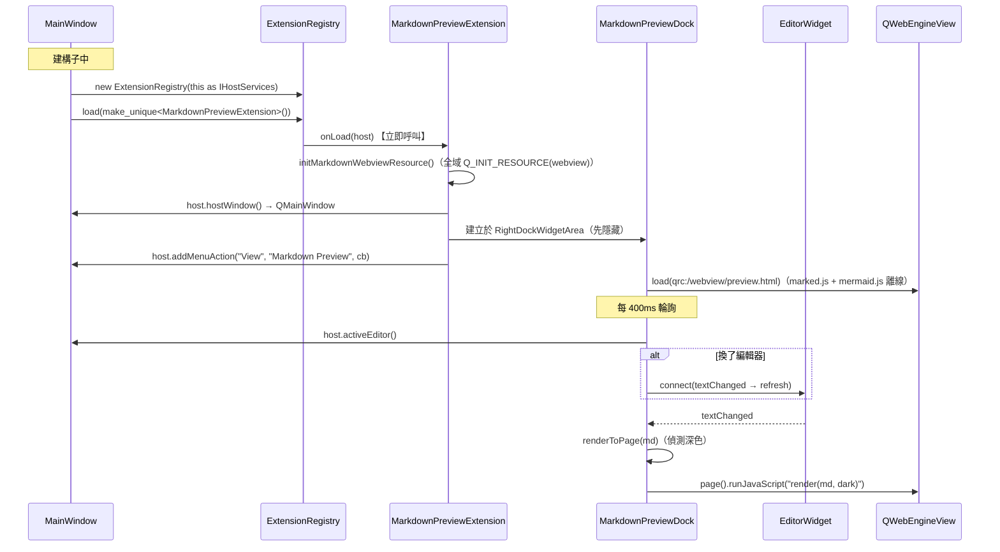
```mermaid
sequenceDiagram
    participant MW as MainWindow
    participant Reg as ExtensionRegistry
    participant Ext as MarkdownPreviewExtension
    participant Dock as MarkdownPreviewDock
    participant EW as EditorWidget
    participant Web as QWebEngineView

    Note over MW: 建構子中
    MW->>Reg: new ExtensionRegistry(this as IHostServices)
    MW->>Reg: load(make_unique<MarkdownPreviewExtension>())
    Reg->>Ext: onLoad(host)  【立即呼叫】
    Ext->>Ext: initMarkdownWebviewResource()（全域 Q_INIT_RESOURCE(webview)）
    Ext->>MW: host.hostWindow() → QMainWindow
    Ext->>Dock: 建立於 RightDockWidgetArea（先隱藏）
    Ext->>MW: host.addMenuAction("View", "Markdown Preview", cb)
    Dock->>Web: load(qrc:/webview/preview.html)（marked.js + mermaid.js 離線）

    Note over Dock: 每 400ms 輪詢
    Dock->>MW: host.activeEditor()
    alt 換了編輯器
        Dock->>EW: connect(textChanged → refresh)
    end
    EW-->>Dock: textChanged
    Dock->>Dock: renderToPage(md)（偵測深色）
    Dock->>Web: page().runJavaScript("render(md, dark)")
```

### 7.5 主題套用（深/淺色 + 顏色柔化 + 使用者覆寫）

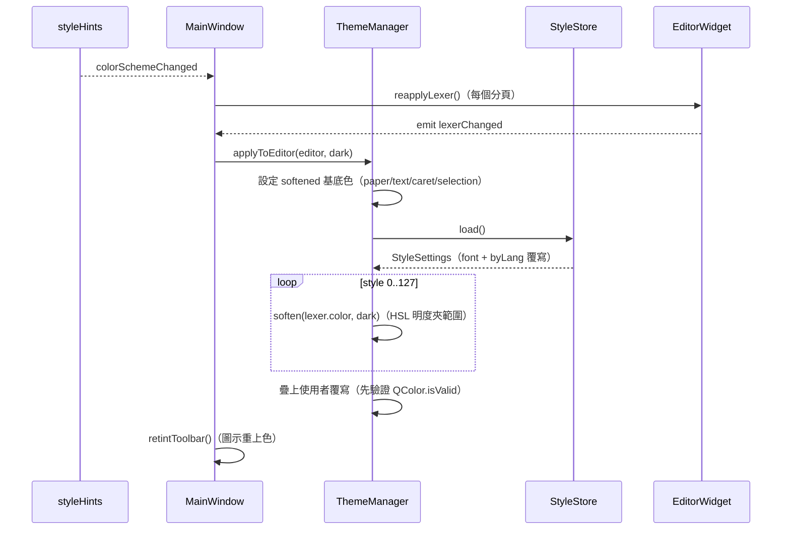
```mermaid
sequenceDiagram
    participant Sys as styleHints
    participant MW as MainWindow
    participant TM as ThemeManager
    participant SS as StyleStore
    participant EW as EditorWidget

    Sys-->>MW: colorSchemeChanged
    MW->>EW: reapplyLexer()（每個分頁）
    EW-->>MW: emit lexerChanged
    MW->>TM: applyToEditor(editor, dark)
    TM->>TM: 設定 softened 基底色（paper/text/caret/selection）
    TM->>SS: load()
    SS-->>TM: StyleSettings（font + byLang 覆寫）
    loop style 0..127
        TM->>TM: soften(lexer.color, dark)（HSL 明度夾範圍）
    end
    TM->>TM: 疊上使用者覆寫（先驗證 QColor.isValid）
    MW->>MW: retintToolbar()（圖示重上色）
```

### 7.6 Session 儲存 / 還原　與　單一實例轉發

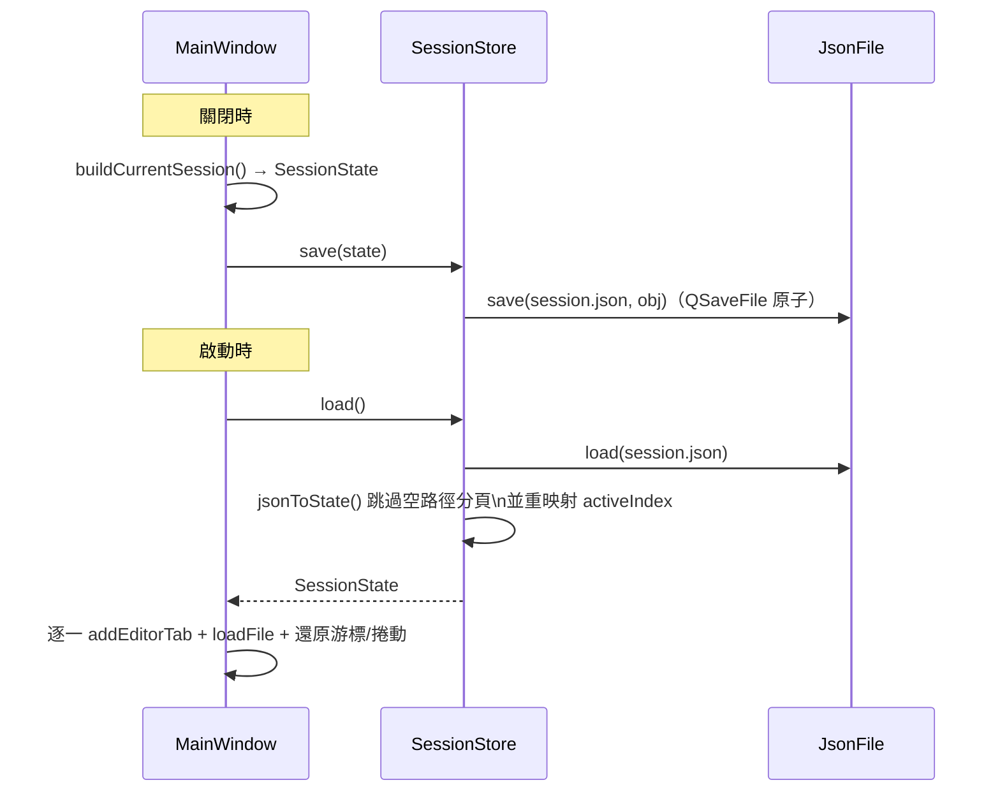
```mermaid
sequenceDiagram
    participant MW as MainWindow
    participant SES as SessionStore
    participant JF as JsonFile

    Note over MW: 關閉時
    MW->>MW: buildCurrentSession() → SessionState
    MW->>SES: save(state)
    SES->>JF: save(session.json, obj)（QSaveFile 原子）

    Note over MW: 啟動時
    MW->>SES: load()
    SES->>JF: load(session.json)
    SES->>SES: jsonToState() 跳過空路徑分頁\n並重映射 activeIndex
    SES-->>MW: SessionState
    MW->>MW: 逐一 addEditorTab + loadFile + 還原游標/捲動
```

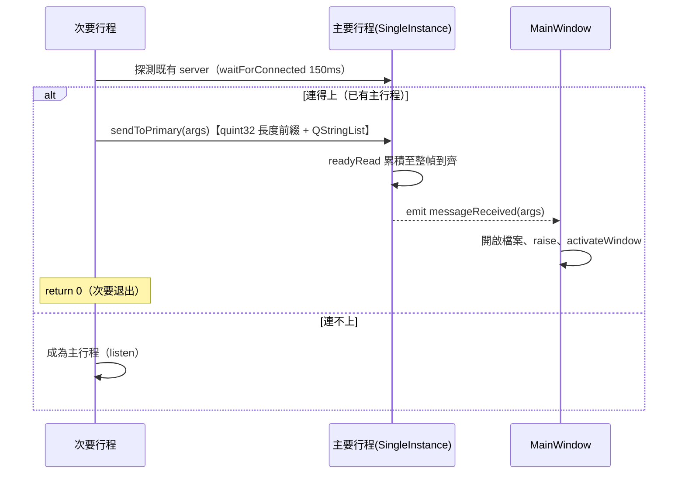
```mermaid
sequenceDiagram
    participant S as 次要行程
    participant P as 主要行程(SingleInstance)
    participant MW as MainWindow

    S->>P: 探測既有 server（waitForConnected 150ms）
    alt 連得上（已有主行程）
        S->>P: sendToPrimary(args)【quint32 長度前綴 + QStringList】
        P->>P: readyRead 累積至整幀到齊
        P-->>MW: emit messageReceived(args)
        MW->>MW: 開啟檔案、raise、activateWindow
        Note over S: return 0（次要退出）
    else 連不上
        S->>S: 成為主行程（listen）
    end
```

### 7.7 巨集錄製 / 播放

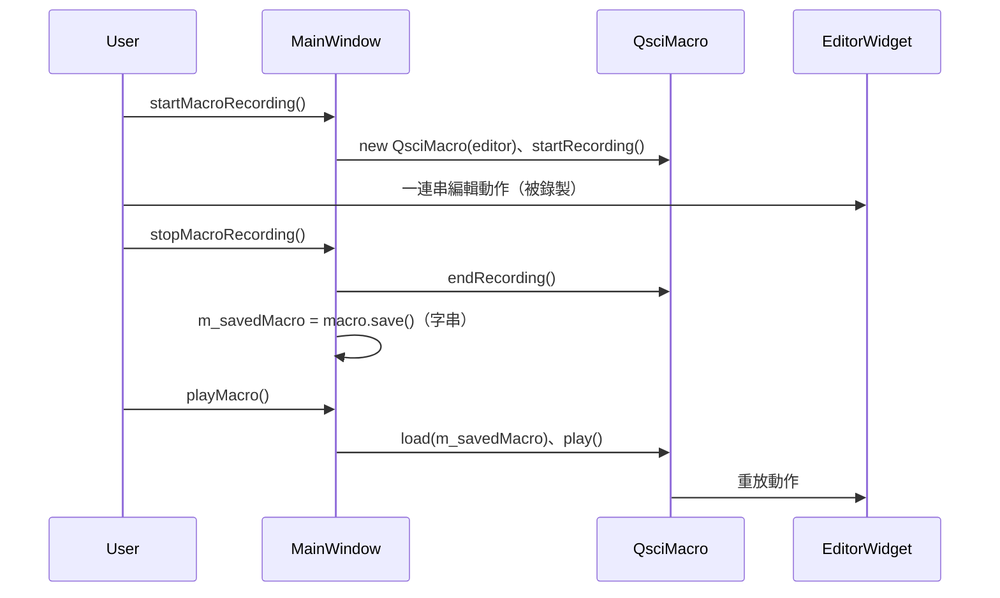
```mermaid
sequenceDiagram
    participant User
    participant MW as MainWindow
    participant Macro as QsciMacro
    participant EW as EditorWidget

    User->>MW: startMacroRecording()
    MW->>Macro: new QsciMacro(editor)、startRecording()
    User->>EW: 一連串編輯動作（被錄製）
    User->>MW: stopMacroRecording()
    MW->>Macro: endRecording()
    MW->>MW: m_savedMacro = macro.save()（字串）
    User->>MW: playMacro()
    MW->>Macro: load(m_savedMacro)、play()
    Macro->>EW: 重放動作
```

---

## 8. 功能流程分析

### 8.1 多分頁編輯（FR-001/002）
每個分頁是一個 `EditorPane`，內含 primary `EditorWidget`（持有檔案狀態）與 split 時的 secondary `QsciScintilla`（**共享同一 `QsciDocument`**，游標/捲動獨立）。`toggleSplit()` 建立/拆除 secondary 並連接四條捲動同步 lambda（存於 `m_syncConns`，拆除時 disconnect 以免 dangling `QScrollBar`；`m_syncing` 防遞迴）。分頁關閉走 `maybeSave`（Save/Discard/Cancel），關閉路徑壓入 `m_closedFiles`（供 Restore Recent Closed）。

### 8.2 檔案 I/O 與編碼（FR-014/019/020）
載入：raw bytes → `FileEncoding::detect`（BOM 嗅探 → 嚴格 UTF-8 探測 → 退回 Latin1；EOL 由首個換行判定）→ `decode` → `setText`。存檔：`QSaveFile` 原子寫入，依 `m_codecName`/`m_encoding` 選 `encodeWithCodec`/`encode`（必要時補 BOM）。**Character sets**：`characterSets()` 提供 13 區域群組約 32 種傳統編碼，透過 `reinterpretWithCodec` 以 `QTextCodec` 重新解讀（先驗證 codec 存在，否則硬失敗回報，不再靜默退回 UTF-8）。

### 8.3 語法高亮與 UDL（FR-006/007）
`LexerFactory` 以副檔名/檔名/語言鍵對應 30+ 內建 `QsciLexer`；`setLexer` 前刪除舊 lexer（避免累積洩漏）。自訂語言：`UdlDefinition`（資料模型）→ `UdlManager` 存於 `udl/*.json`（檔名以 Unicode `\w` 清洗，保留 CJK 名稱避免塌成同名）→ `UdlLexer`（`QsciLexerCustom`）在 `styleText` 中**從文件起點整篇重掃**（因區塊註解跨行狀態，Scintilla 無法從 `start` 得知是否位於註解中；並處理 `\"` 逸出）。

### 8.4 搜尋家族（FR-010/011/012/013）
- **Find/Replace**（`FindReplaceDialog`，非模態）：驅動 `EditorWidget::findFirst/replace/replaceAll/markAll`；正則用 C++11 `std::regex`。**Replace One 守衛**：僅當目前選取 == 上次命中範圍（`rememberMatch`/`selectionIsRememberedMatch` + 4 個 int）才取代，避免覆寫使用者手動選取。增量搜尋 wrap 依勾選狀態。
- **Find in Files**（`FindInFilesEngine` 靜態、`FindInFilesDock` UI）：搜尋與取代皆以 `QtConcurrent::run` 背景執行、`std::atomic<bool>` 取消旗標、`QFutureWatcher` 回收；正則**每輪只編譯一次**；讀寫**經 `FileEncoding` 偵測編碼往返**（不再 raw UTF-8，避免毀損非 UTF-8 檔）。結果雙擊 → `openLocation` → `MainWindow::openFileAtLine`。

### 8.5 編輯操作與欄位編輯（Edit 選單）
`TextOps` 提供大小寫/排序/去重/裁切/縮排轉換等純 `QString→QString` 轉換；`ColumnEditor` 提供矩形插入遞增數列（`NumberSeqSpec`，支援 10/16/8/2 進位與補零）。`EditorWidget` 另有折疊（`foldAllBlocks/foldToLevel/foldCurrent`）、區塊註解（依 lexer 語言選 token）、書籤進階操作（保留/刪除/反轉/取出書籤行）。

### 8.6 檢視輔助面板（FR-026/029/030）
DocumentList（分頁切換）、FunctionList（`FunctionListParser` 正則抽取符號）、ClipboardHistory（監聽 `qApp->clipboard()`）、DocumentMap（共享 document 的縮圖，`zoomTo(-8)`）、Workspace（`QFileSystemModel` 資料夾樹）、CharacterPanel（256 字元表）。各 Dock 以 signal 回呼 MainWindow（`activated`/`symbolActivated`/`pasteRequested`/`lineClicked`/`fileActivated`/`charChosen`）。

### 8.7 執行外部命令（FR-031）
`RunCommand::expand` 以單次線性掃描代換 `$(FULL_CURRENT_PATH)` 等變數（代換值不會被後續 marker 再掃）；`tokenize` 尊重使用者引號切出 argv。`RunDock` 先 tokenize 原樣板再逐 token expand（避免展開值被再切割），以 `QProcess`（argv 陣列、無 shell → 無注入）執行並串流輸出。

### 8.8 主題與樣式（FR-021/034）
`ThemeManager::soften` 在 HSL 空間對顏色降飽和（×0.55）並夾明度（深色 155–205、淺色 70–120），使任何 lexer 配色在深/淺底都可讀；再疊上 `StyleStore` 的使用者覆寫（覆寫前驗證 `QColor::isValid`）。系統配色變更透過 `styleHints()::colorSchemeChanged` 即時重套並 `retintToolbar()`。

### 8.9 持久化與 Session（FR-016）
所有設定經 `JsonFile`（`QSaveFile` 原子寫入、載入時容錯回空物件）。`SessionStore` 記錄每分頁 path/caret/scroll 與 activeIndex（還原時跳過空路徑分頁並**重映射 activeIndex**）；具名 session 檔名附 **SHA-1 前 8 碼**避免碰撞。`RecentFiles` 為 20 筆 MRU，`add/clear` 回傳 `bool` 以符合 IL-4 失敗快失敗明。

### 8.10 外掛協定（FR-035/037）
`MainWindow` 同時實作 `IHostServices`。`ExtensionRegistry::load` 取得所有權並**立即** `onLoad(host)`。內建 WordCount（Edit 選單、code-point 計字）與 MarkdownPreview（`QWebEngineView` 載入 `qrc:/webview/preview.html`，輪詢 activeEditor + 監聽 textChanged，`runJavaScript("render(md,dark)")` 離線渲染 Mermaid）。`addMenuAction` 以 `objectName` 比對選單（翻譯會改 title，故不可用 title）。

### 8.11 國際化（i18n）
`main.cpp` 在**建構 `MainWindow` 之前**依 `settings.language`/系統 locale 解析語言並安裝 `QTranslator`（選單在建構子建立，太晚安裝就不會被翻譯）。四語系：`zh_TW`/`zh_CN`/`ja`/`en`，資源打包於 `i18n.qrc`。

---

## 9. 關鍵設計決策

| # | 決策 | 理由 / Trade-off |
|---|------|-----------------|
| D-1 | **靜態庫 `macpad_lib` + 薄殼 exe** | 讓 QtTest 直接連結核心邏輯；代價是 `.qrc` 需手動 `Q_INIT_RESOURCE`。 |
| D-2 | **核心/GUI 分離、大量無狀態 static 工具類別** | 純邏輯（編碼、搜尋引擎、文字操作、持久化）不需 GUI 即可測；GUI 類別薄。 |
| D-3 | **in-process extension protocol 取代 DLL 外掛** | macOS 無法載入 Windows `.dll`；`IExtension`/`IHostServices` 提供受限、穩定（CON-007 凍結）介面。 |
| D-4 | **JSON + `QSaveFile` 原子寫入** | 崩潰/斷電不損毀設定；載入容錯回空物件。 |
| D-5 | **傳統編碼走 Qt6 Core5Compat（`QTextCodec`）** | 複刻 Notepad++ Character sets 且維持可攜；Unicode 路徑用新式 `QStringConverter`。 |
| D-6 | **HSL 顏色柔化而非硬換配色** | 任意 lexer 配色在深/淺底皆可讀，且尊重使用者 `StyleStore` 覆寫。 |
| D-7 | **編輯器內部 UTF-8 + byte offset** | 與 Scintilla 原生一致；代價是識別字/字元處理需注意多位元組（call-tip、計字已修正）。 |
| D-8 | **UDL lexer 整篇重掃** | 正確處理跨行區塊註解；代價是大檔重掃成本（可接受，屬 UDL 少數語言）。 |
| D-9 | **單一實例 IPC 加長度前綴框架** | `QLocalSocket` 的 `readyRead` 可能分段到達，避免 `QDataStream` underflow 靜默丟參數。 |
| D-10 | **選單以 `objectName` 定位** | i18n 會改變 `title()`，用穩定英文鍵才不會建出重複的翻譯選單。 |

> 重大技術選型與 Major 契約升版前，應另立 ADR（`.decisions/ADR_{N}_{SLUG}.md`，見憲法 §13）。

---

## 10. 品質與測試

- **測試**：17 個 QtTest 套件（`QT_QPA_PLATFORM=offscreen`），另有 `bench_largefile` 效能基準。全綠、`-Werror` 零警告。
- **覆蓋策略**：「純邏輯可測、GUI 不測」。實測 `src/` 行覆蓋約 **22%**；分層差異大：persistence ~75%、core/features ~54%、而 app/ui/platform ≈ 0%（無 GUI 測試實體化 `MainWindow`/對話框/`ThemeManager`/`SingleInstance`）。
- **落差**：憲法 §10 訂單元測試 ≥80%，目前未達標。優先補測建議：`RunCommand`、`FileEncoding` codec 往返、`SingleInstance` 訊息框架、`ThemeManager::soften`，以及以 offscreen 實體化 `MainWindow` 測工具列/選單同步與 autosave 夾範圍。

---

## 11. 附錄：目錄結構

```
src/
├── app/           main.cpp（啟動序列）、MainWindow（協調者 + IHostServices）
├── core/          EditorWidget、FileEncoding、LexerFactory
├── features/
│   ├── search/           FindReplaceDialog
│   ├── findinfiles/      FindInFilesEngine（靜態）、FindInFilesDock
│   ├── udl/              UdlDefinition、UdlLexer、UdlManager
│   ├── run/             RunCommand（靜態）、RunDock
│   ├── textops/          TextOps（靜態）
│   ├── columneditor/     ColumnEditor（靜態）
│   ├── export/           HtmlExporter（靜態）
│   ├── functionlist/     FunctionListParser（靜態）
│   ├── clipboard/        ClipboardHistory
│   └── cli/             CliArgs（靜態）
├── persistence/   AppPaths、JsonFile、SettingsStore、StyleStore、SessionStore、RecentFiles
├── platform/      ThemeManager、SingleInstance
├── ui/            EditorPane、DocumentListDock、Panels（Function/Clipboard/DocumentMap）、
│                  WorkspaceDock、CharacterPanel、各式 Dialog
└── extension/     IExtension/IHostServices、ExtensionRegistry、builtin/{WordCount,MarkdownPreview}

resources/  icon/（.icns/.svg）、icons/（工具列 SVG）、i18n/（.ts/.qm）、webview/（marked+mermaid）
docs/       design.md（本檔）、parity.md、plugin-development.md
tests/      unit/（17 套件）、benchmark/
```

---

*本設計文件由六個平行程式碼探勘 agent 從實際原始碼抽取結構後合成，反映 commit `17f10cc` 之後的狀態。程式碼演進時應同步更新本檔。*

---

## 12. Sprint 1 — Parity 缺口實作設計

> 對應 PRD v1.1.0 附錄 A（FR-038..FR-052）、SRS §9、ModuleInterfaces §7。本節記錄 Sprint 1 為縮小
> 與 Notepad++ 差距而新增的設計。所有變更皆為**加法式**，不改既有模組邊界。

### 12.1 設計原則
- **純邏輯優先**：文字/排序/欄位/CLI/Session 等以無狀態 static 函式或純資料 struct 實作，維持高可測性（延續既有 65%→91% 覆蓋策略）。
- **加法相容**：新方法/新欄位帶預設值；既有公開簽章與 25 個測試不動。
- **UI 接線集中於 app 層**：核心方法由 `MainWindow` 於選單/對話框接線曝光，核心模組不反向依賴 app。

### 12.2 各模組新增

| 模組 | 新增 | FR |
|------|------|----|
| `TextOps` | toRandomCase / removeConsecutiveDuplicateLines / shuffleLines / sortLinesLocale / sortLinesByLength / sortLinesAsDecimals / trimBoth / eolToSpace / spacesToTabsLeading | 038–041 |
| `ColumnEditor` | insertTextColumn 接線 + formatNumber 遵循 upperHex | 042 |
| `FindInFilesEngine` | FindInFilesOptions.includeHidden / excludeFilters + isExcluded() | 045 |
| `EditorWidget` | countMatches / reinterpretAsEncoding / cutBookmarkedLines / pasteReplaceBookmarkedLines / setAutoClose+closerFor / replaceAll(dotAll) 多載 / AcsDocument 自動完成 | 043/044/047/048/049/050 |
| `FindReplaceDialog` | Count 按鈕 / Swap 欄位 / In-selection / dot-all 勾選 | 043/044 |
| `CliArgs` | FileArg.column + ParsedArgs + parse() | 051 |
| `SessionStore` | TabState.selection / bookmarks / languageOverride | 052 |
| `MainWindow` | Edit/Search/Encoding 選單接線；main.cpp 套 CliArgs::parse；跨文件取代迴圈 | 040–052 |

### 12.3 關鍵設計決策（Sprint 1）
- **隨機類函式帶 seed**（`toRandomCase`/`shuffleLines`）：以 `std::mt19937` + 可選種子參數（預設隨機），讓單元測試以固定種子斷言決定性輸出。
- **`reinterpretAsEncoding` vs `reinterpretWithCodec`**：前者用內建 `Encoding` enum（UTF-8/16）只重新解碼不轉碼（FR-050，對映 Notepad++「Encode in…」）；後者用 `QTextCodec` 處理傳統編碼（既有 FR-019）。兩者並存、語意不同。
- **自動配對可測試化**：把「輸入字元 → 對應閉合字元」的決策抽為 `static QChar EditorWidget::closerFor(QChar)`，讓邏輯不必透過 `keyPressEvent` 也能單元測試；`m_autoClose` 開關保留既有 `(` 觸發 call tip 行為。
- **`replaceAll` dot-all 以多載加入**：不動既有 `replaceAll` 簽章，新增帶 `bool dotAll` 的多載，僅在該路徑改變 `.` 的換行匹配語意（std::regex `match_not_dotall` 反向）。
- **Session 向後相容**：新欄位缺省即回退（舊 session 檔無 `selection`/`bookmarks`/`language_override` 鍵時採空值），維持既有 `activeIndex` 跳空重映射修正。

### 12.4 自動配對時序

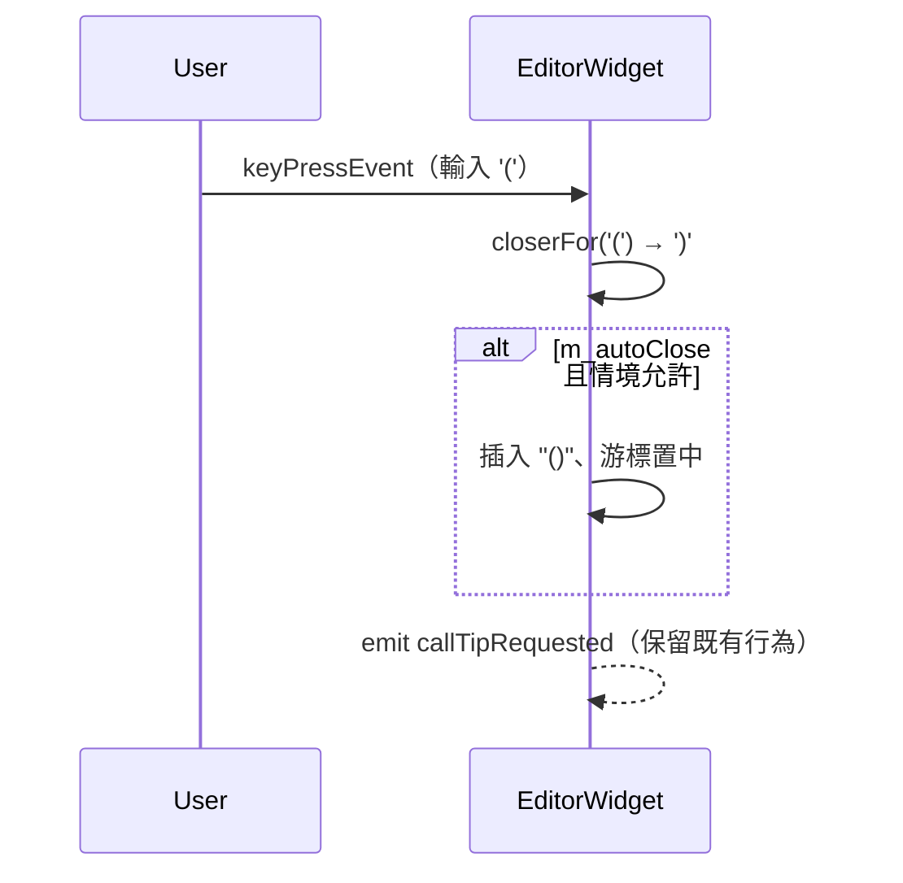
```mermaid
sequenceDiagram
    participant User
    participant EW as EditorWidget
    User->>EW: keyPressEvent（輸入 '('）
    EW->>EW: closerFor('(') → ')'
    alt m_autoClose 且情境允許
        EW->>EW: 插入 "()"、游標置中
    end
    EW-->>EW: emit callTipRequested（保留既有行為）
```

### 12.5 尚未納入（FR-053..FR-060，後續 Sprint）
完整 Preferences 分類、非破壞性備份/當機復原、進階自動完成引擎（API/函式/路徑 + XML 定義）、具名多主題系統、Change History margin、文件內 Find All 結果視窗、UDL 進階（多關鍵字組/Operators/Delimiters/Export/Styler）、Paste Special / Multi-Select 指令集 / Virtual Space。這些屬大型子系統，已於 PRD/SRS 文件化，待後續迭代。

---

*Sprint 1 增補（§12）反映 Parity 缺口第一波實作；`docs/parity-audit.md` 之狀態於實作後同步更新。*

---

## 13. Sprint 2 — 大型子系統（FR-053..FR-060）

> 對應 PRD v1.2.0 B 組、SRS §10。Sprint 2 補完先前延後的大型子系統。設計延續「純邏輯優先、
> 加法相容、UI 接線集中於 app 層」原則，並盡量以**新模組/新檔**承載，降低與既有碼耦合。

### 13.1 新增模組與檔案

| 子系統 | FR | 主要檔案（新增/擴充） |
|--------|----|----------------------|
| 進階自動完成引擎 | FR-055 | `features/autocomplete/ApiDatabase`（新，per-lang 關鍵字/函式/callTip/path）+ `core/EditorWidget::applyApiCompletions`（QsciAPIs） |
| 具名多主題 | FR-056 | `persistence/ThemeStore`（新，themes/*.json）+ `platform/ThemeManager::applyNamedTheme` + `ui/ThemePickerDialog`（新） |
| Find All 結果視窗 | FR-058 | `features/findall/FindAllEngine`（新，純搜尋）+ `features/findall/FindAllDock`（新，結果面板） |
| 非破壞性備份/當機復原 | FR-054 | `features/backup/BackupService`（新，.bak + snapshot） |
| 完整 Preferences | FR-053 | `ui/PreferencesDialog`（改為分類頁）+ `persistence/SettingsStore`（擴充欄位） |
| UDL 進階 | FR-059 | `features/udl/*`（多關鍵字組/operators/delimiters/folder/export）+ `ui/UdlEditorDialog` |
| Change History / Virtual Space / Multi-Select | FR-057/060 | `core/EditorWidget`（Scintilla 訊息封裝） |
| On-Selection / Paste Special | FR-060 | `app/MainWindow`（選單接線） |

### 13.2 關鍵設計決策（Sprint 2）
- **Scintilla 進階功能封裝**（FR-057/060）：Change History、Virtual Space、Multiple-Selection-Add-Next 皆為 Scintilla 5 原生訊息；EditorWidget 以 `SendScintilla(SCI_...)` 封裝並提供高階方法，未由 QScintilla 匯出的常數就地 `constexpr` 定義；能力不足時安全 no-op（版本相容）。
- **自動完成資料與引擎分離**（FR-055）：`ApiDatabase`（純資料/邏輯、可完整單元測試）與 `EditorWidget::applyApiCompletions`（QsciAPIs 綁定、GUI）解耦；MainWindow 於 lexer 變更時把 `ApiDatabase::entriesFor(lang)` 餵給編輯器。
- **主題檔化**（FR-056）：主題以 JSON（重用 `StyleSettings` 結構）存於 config `themes/`，可匯入匯出分享；`ThemeManager::applyNamedTheme` 套用。與既有即時深/淺色 soften 並存（主題覆寫優先）。
- **備份決定性測試**（FR-054）：`BackupService` 的時間戳由呼叫端傳入（不呼叫 wall-clock），使 Verbose 檔名可被單元測試斷言；snapshot 走 config `snapshots/`，啟動掃描 `pendingSnapshots()` 實現當機復原。
- **UDL 向後相容**（FR-059）：`UdlDefinition` schema 升版；舊單一 `keywords` 載入為群組 0，新增多群組/operators/delimiters/folder；`fromJson` 對缺欄位回退。

### 13.3 Find All 資料流
```mermaid
flowchart LR
    MW[MainWindow] -->|各開啟文件內容| ENG[FindAllEngine.searchInText]
    ENG -->|QVector FindAllMatch| DOCK[FindAllDock.setResults]
    DOCK -->|雙擊 openLocation docId,line,col| MW
    MW -->|聚焦分頁 + 定位| EW[EditorWidget]
```

### 13.4 完成後狀態
Sprint 2 完成後，`docs/parity-audit.md` 的 B 組（FR-053..060）由 missing/partial 轉為已實作；殘餘僅 `na_macos`（Windows DLL 外掛、登錄檔 File Association、MIME tools 等平台不可能項目）。

---

*Sprint 2 增補（§13）補完大型子系統；狀態於實作後同步至 `docs/parity-audit.md` 與 `sprint/current/status.md`。*

### 13.5 Sprint 3 收尾（FR-053/FR-054 完成）
清除 Sprint 2 遺留 TODO，使兩個子系統真正完整：
- **Preferences 即時套用**：`EditorWidget` 新增 `setShowLineNumbers`/`setCaretWidth`(override)/`setWordCompletionEnabled`/`setCallTipsEnabled`(+`m_callTips` 守衛 `(` call-tip)。MainWindow 新增 `applyEditorPrefs(editor, settings)`，於 Preferences 套用與 `addEditorTab` 皆呼叫，讓現有與新分頁一致套用 tabWidth/行號/游標寬/自動配對/自動完成/threshold/call-tip/檢視偏好。
- **當機復原真實化**：原本 `writeSnapshot` 從未被呼叫（機制空轉）。新增 30 秒週期 `QTimer`，對 dirty 分頁 `BackupService::writeSnapshot`；啟動時若 `pendingSnapshots()` 非空，開 `SnapshotRecoveryDialog`（多選還原/全部丟棄），取代原資訊框；`closeEvent` 正常關閉清空快照。
- **大檔守衛**（`largeFileMB`）：`openFile` 超過門檻先確認。**失焦自存**（`autosaveOnFocusLoss`）：`applicationStateChanged` 非 active 時存已命名之未存分頁。
- 驗證：CTest 30/30、-Werror 零警告、功能覆蓋率 90.5%。
