# macpad++ Design Document

**English** · [繁體中文](design.zh-TW.md)

> **Version**: 1.0.0　**Date**: 2026-07-07　**Corresponding code**: after commit `17f10cc`
> **Scope**: complete architecture-level design notes — system overview, layer responsibilities,
> component dependencies, class diagrams, sequence diagrams for the main features, feature flow
> analysis and key design decisions.
> **Audience**: future maintainers, contributors, and anyone wanting to understand the overall
> structure.
> All diagrams are drawn in Mermaid (per team constitution §12: no external images).

> **Status note (2026-07-30, v0.6.0)**: §1 below describes the project as macOS-only, which reflects
> the state at the time of writing. Since v0.5.0 macpad++ ships for **both macOS and Windows 10/11**
> from one source tree; see [`windows_sa_sd.md`](windows_sa_sd.md) for the port's architecture and
> §20 for what changed in v0.6.0.

---

## Contents

1. [System overview](#1-system-overview)
2. [Architecture overview](#2-architecture-overview)
3. [Component diagram](#3-component-diagram)
4. [Layer responsibilities](#4-layer-responsibilities)
5. [Core data flow](#5-core-data-flow)
6. [Class diagrams](#6-class-diagrams)
7. [Sequence diagrams for the main features](#7-sequence-diagrams-for-the-main-features)
8. [Feature flow analysis](#8-feature-flow-analysis)
9. [Key design decisions](#9-key-design-decisions)
10. [Quality and testing](#10-quality-and-testing)
11. [Appendix: directory structure](#11-appendix-directory-structure)

---

## 1. System overview

**macpad++** is a native macOS text and source editor whose goal is to reproduce Notepad++'s
functionality on the Mac. (As of v0.5.0 it also ships natively on Windows 10/11 — see the status note
above.)

| Aspect | Content |
|--------|---------|
| **Language / standard** | C++17 |
| **GUI framework** | Qt6 Widgets |
| **Editing core** | QScintilla (`QsciScintilla` / `QsciLexer` / `QsciLexerCustom` / `QsciMacro`) |
| **Build** | CMake (out-of-source enforced), AUTOMOC/AUTORCC/AUTOUIC |
| **Legacy encodings** | Qt6 Core5Compat (`QTextCodec`; Big5 / GBK / Shift-JIS …) |
| **Plugin preview** | Qt6 WebEngineWidgets (offline Markdown + Mermaid rendering) |
| **Icons** | Qt6 Svg (`QSvgRenderer`; monochrome toolbar icons recoloured with the theme) |
| **Dependency location** | Homebrew: `qt`, `qscintilla2` |

**Design principles**: standalone; no backend, no network, no database; core logic separated from the
GUI to enable unit testing; all user data stored as atomically-written JSON under
`~/Library/Application Support/macpad++/`.

**Non-goals**: loading Notepad++'s Windows `.dll` binary plugins (a platform limitation, replaced by an
in-process extension protocol); cross-platform support (most of the code is portable, but macOS was the
explicit delivery target at the time of writing).

---

## 2. Architecture overview

### 2.1 Layered architecture

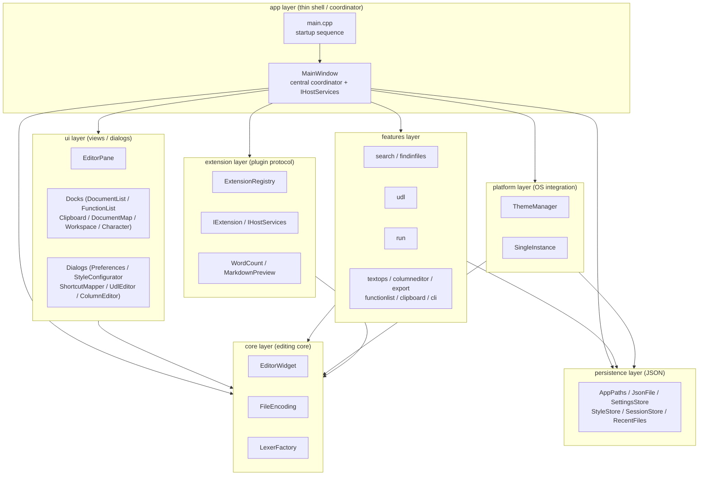
```mermaid
flowchart TB
    subgraph app["app layer (thin shell / coordinator)"]
        main["main.cpp\nstartup sequence"]
        MW["MainWindow\ncentral coordinator + IHostServices"]
    end
    subgraph core["core layer (editing core)"]
        EW["EditorWidget"]
        FE["FileEncoding"]
        LF["LexerFactory"]
    end
    subgraph features["features layer"]
        SR["search / findinfiles"]
        UDL["udl"]
        RUN["run"]
        MISC["textops / columneditor / export\nfunctionlist / clipboard / cli"]
    end
    subgraph ui["ui layer (views / dialogs)"]
        PANE["EditorPane"]
        DOCKS["Docks (DocumentList / FunctionList\nClipboard / DocumentMap / Workspace / Character)"]
        DLGS["Dialogs (Preferences / StyleConfigurator\nShortcutMapper / UdlEditor / ColumnEditor)"]
    end
    subgraph persistence["persistence layer (JSON)"]
        STORES["AppPaths / JsonFile / SettingsStore\nStyleStore / SessionStore / RecentFiles"]
    end
    subgraph platform["platform layer (OS integration)"]
        TM["ThemeManager"]
        SI["SingleInstance"]
    end
    subgraph extension["extension layer (plugin protocol)"]
        REG["ExtensionRegistry"]
        IEXT["IExtension / IHostServices"]
        BUILTIN["WordCount / MarkdownPreview"]
    end

    main --> MW
    MW --> core
    MW --> features
    MW --> ui
    MW --> persistence
    MW --> platform
    MW --> extension
    ui --> core
    features --> core
    features --> persistence
    platform --> core
    platform --> persistence
    extension --> core
```

### 2.2 Build shape: static library + thin shell

All of `src/**` compiles into a single static library **`macpad_lib`**; the executable **`macpad++`**
(a macOS bundle) contains only `app/main.cpp` and links `macpad_lib`. Unit tests likewise link
`macpad_lib` + `Qt6::Test`, so core logic can be tested directly without starting a GUI.

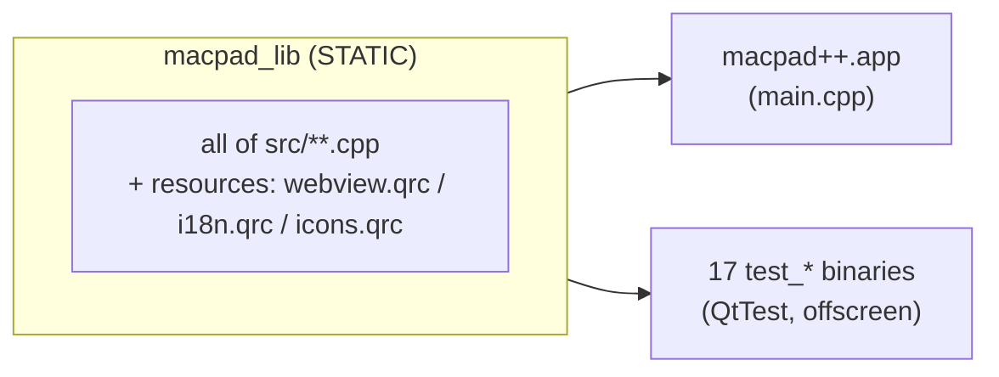
```mermaid
flowchart LR
    subgraph lib["macpad_lib (STATIC)"]
        srcs["all of src/**.cpp\n+ resources: webview.qrc / i18n.qrc / icons.qrc"]
    end
    exe["macpad++.app\n(main.cpp)"]
    tests["17 test_* binaries\n(QtTest, offscreen)"]
    lib --> exe
    lib --> tests
```

> **Qt resources (.qrc) inside a static library** must be initialised explicitly with
> `Q_INIT_RESOURCE(<qrc-basename>)` or the linker strips them; the call must live in the **global
> namespace** (`i18n`/`icons` are called from `main.cpp` / `MainWindow::buildToolbar`, `webview` from a
> global helper in the plugin).

---

## 3. Component diagram

Modules are nodes and arrows are "compile-time / call dependencies". Note that dependencies point
cleanly from outer to inner layers (`core` never depends back on anything above it).

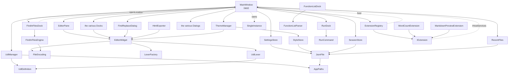
```mermaid
flowchart TB
    MW["MainWindow\n(app)"]

    MW --> EditorPane
    MW --> ExtensionRegistry
    MW --> FindReplaceDialog
    MW --> FindInFilesDock
    MW --> RunDock
    MW --> Docks["the various Docks"]
    MW --> Dialogs["the various Dialogs"]
    MW --> UdlManager
    MW --> SettingsStore
    MW --> SessionStore
    MW --> RecentFiles
    MW --> ThemeManager
    MW -.owns.-> SingleInstance

    EditorPane --> EditorWidget
    Docks --> EditorWidget
    FindReplaceDialog --> EditorWidget
    FindInFilesDock --> FindInFilesEngine
    FindInFilesDock -. openLocation .-> MW
    RunDock --> RunCommand

    EditorWidget --> FileEncoding
    EditorWidget --> LexerFactory
    EditorWidget --> UdlLexer

    UdlManager --> UdlDefinition
    UdlLexer --> UdlDefinition
    UdlManager --> AppPaths

    FindInFilesEngine --> FileEncoding
    HtmlExporter --> EditorWidget
    FunctionListDock --> FunctionListParser

    ThemeManager --> StyleStore
    ThemeManager --> EditorWidget

    SettingsStore --> JsonFile
    StyleStore --> JsonFile
    SessionStore --> JsonFile
    RecentFiles --> JsonFile
    JsonFile --> AppPaths

    ExtensionRegistry --> IExtension
    ExtensionRegistry -. host .-> MW
    IExtension -. IHostServices .-> MW
    WordCountExtension --> IExtension
    MarkdownPreviewExtension --> IExtension
```

---

## 4. Layer responsibilities

| Layer | Namespace | Responsibility | GUI? |
|-------|-----------|----------------|:----:|
| **app** | (global) `MainWindow` | Startup sequence, central coordination, assembling menus/toolbar/status bar/docks, signal wiring, acting as the plugin host | ✅ |
| **core** | `macpad::core` | The editing core: `EditorWidget` (Scintilla wrapper, file I/O, encoding/EOL, bookmarks, folding, call tips), `FileEncoding` (detection/encode/decode), `LexerFactory` (extension → lexer) | partly |
| **features** | `macpad::features` | Pure logic units: search, Find-in-Files, UDL, Run, text operations, column editing, HTML export, function list, clipboard history, CLI parsing | a few |
| **ui** | `macpad::ui` | Views and dialogs: `EditorPane` (splitting), the docks, the dialogs | ✅ |
| **persistence** | `macpad::persistence` | JSON persistence: `AppPaths`, `JsonFile` (atomic writes), `SettingsStore`, `StyleStore`, `SessionStore`, `RecentFiles` | ❌ |
| **platform** | `macpad::platform` | OS integration: `ThemeManager` (dark/light + colour softening), `SingleInstance` (single-instance IPC) | ❌ |
| **extension** | `macpad::extension` | The `IExtension`/`IHostServices` plugin protocol, `ExtensionRegistry`, built-in plugins | partly |

**Testability by design**: persistence, platform and most of features are **stateless static function
classes** or plain data structs, unit-testable without a GUI; `EditorWidget` inherits `QsciScintilla`,
so tests instantiate it under `QT_QPA_PLATFORM=offscreen`.

---

## 5. Core data flow

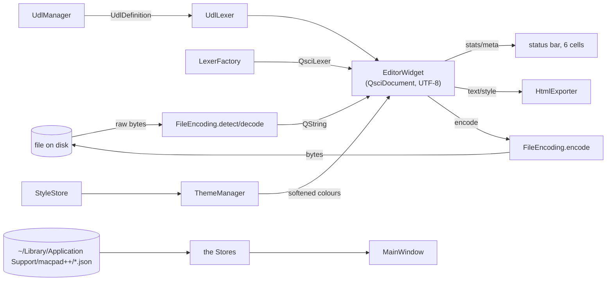
```mermaid
flowchart LR
    disk[("file on disk")] -->|raw bytes| FE["FileEncoding.detect/decode"]
    FE -->|QString| EW["EditorWidget\n(QsciDocument, UTF-8)"]
    LF["LexerFactory"] -->|QsciLexer| EW
    UDLM["UdlManager"] -->|UdlDefinition| UDLL["UdlLexer"] --> EW
    EW -->|stats/meta| SB["status bar, 6 cells"]
    EW -->|text/style| HE["HtmlExporter"]
    EW -->|encode| FE2["FileEncoding.encode"] -->|bytes| disk
    TM["ThemeManager"] -->|softened colours| EW
    SS["StyleStore"] --> TM
    cfg[("~/Library/Application Support/macpad++/*.json")] --> stores["the Stores"] --> MW["MainWindow"]
```

**Key points**:
- `EditorWidget` is always UTF-8 internally (`setUtf8(true)`), so every Scintilla position is a **byte
  offset**.
- The detection result at load time (`Encoding`/`Eol`) is stored on the editor; if the user
  reinterprets with a legacy encoding, `m_codecName` is set and saving goes through `encodeWithCodec`.
- Syntax colours are not decided by the lexer alone: `ThemeManager` softens each style's colour in HSL
  and then layers `StyleStore`'s user overrides on top.

---

## 6. Class diagrams

> Split by layer for readability. Method signatures are simplified (some parameters and `const`
> omitted).

### 6.1 app + core

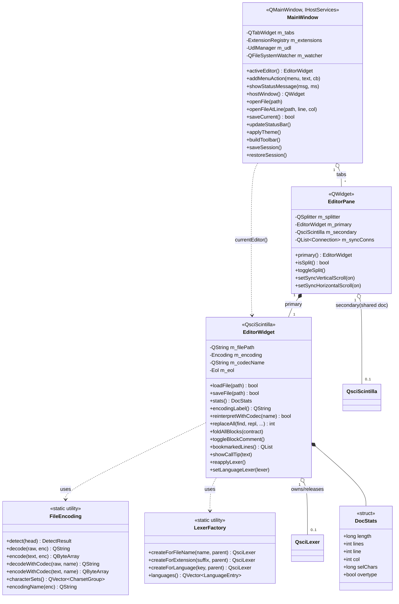
```mermaid
classDiagram
    class MainWindow {
        <<QMainWindow, IHostServices>>
        -QTabWidget m_tabs
        -ExtensionRegistry m_extensions
        -UdlManager m_udl
        -QFileSystemWatcher m_watcher
        +activeEditor() EditorWidget
        +addMenuAction(menu, text, cb)
        +showStatusMessage(msg, ms)
        +hostWindow() QWidget
        +openFile(path)
        +openFileAtLine(path, line, col)
        +saveCurrent() bool
        +updateStatusBar()
        +applyTheme()
        +buildToolbar()
        +saveSession()
        +restoreSession()
    }
    class EditorPane {
        <<QWidget>>
        -QSplitter m_splitter
        -EditorWidget m_primary
        -QsciScintilla m_secondary
        -QList~Connection~ m_syncConns
        +primary() EditorWidget
        +isSplit() bool
        +toggleSplit()
        +setSyncVerticalScroll(on)
        +setSyncHorizontalScroll(on)
    }
    class EditorWidget {
        <<QsciScintilla>>
        -QString m_filePath
        -Encoding m_encoding
        -QString m_codecName
        -Eol m_eol
        +loadFile(path) bool
        +saveFile(path) bool
        +stats() DocStats
        +encodingLabel() QString
        +reinterpretWithCodec(name) bool
        +replaceAll(find, repl, ...) int
        +foldAllBlocks(contract)
        +toggleBlockComment()
        +bookmarkedLines() QList
        +showCallTip(text)
        +reapplyLexer()
        +setLanguageLexer(lexer)
    }
    class DocStats {
        <<struct>>
        +long length
        +int lines
        +int line
        +int col
        +long selChars
        +bool overtype
    }
    class FileEncoding {
        <<static utility>>
        +detect(head) DetectResult
        +decode(raw, enc) QString
        +encode(text, enc) QByteArray
        +decodeWithCodec(raw, name) QString
        +encodeWithCodec(text, name) QByteArray
        +characterSets() QVector~CharsetGroup~
        +encodingName(enc) QString
    }
    class LexerFactory {
        <<static utility>>
        +createForFileName(name, parent) QsciLexer
        +createForExtension(suffix, parent) QsciLexer
        +createForLanguage(key, parent) QsciLexer
        +languages() QVector~LanguageEntry~
    }

    MainWindow "1" o-- "*" EditorPane : tabs
    EditorPane "1" *-- "1" EditorWidget : primary
    EditorPane "1" o-- "0..1" QsciScintilla : secondary(shared doc)
    EditorWidget ..> FileEncoding : uses
    EditorWidget ..> LexerFactory : uses
    EditorWidget "1" o-- "0..1" QsciLexer : owns/releases
    EditorWidget *-- DocStats
    MainWindow ..> EditorWidget : currentEditor()
```

### 6.2 features: search / Find-in-Files / UDL / Run

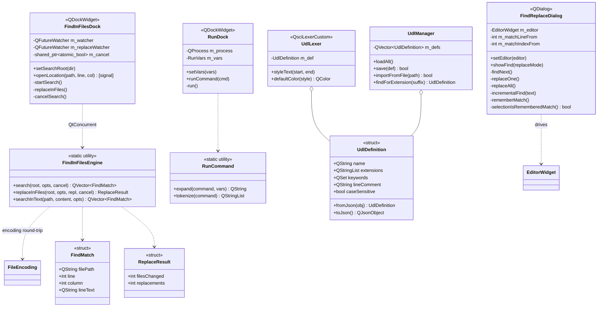
```mermaid
classDiagram
    class FindReplaceDialog {
        <<QDialog>>
        -EditorWidget m_editor
        -int m_matchLineFrom
        -int m_matchIndexFrom
        +setEditor(editor)
        +showFind(replaceMode)
        -findNext()
        -replaceOne()
        -replaceAll()
        -incrementalFind(text)
        -rememberMatch()
        -selectionIsRememberedMatch() bool
    }
    class FindInFilesEngine {
        <<static utility>>
        +search(root, opts, cancel) QVector~FindMatch~
        +replaceInFiles(root, opts, repl, cancel) ReplaceResult
        +searchInText(path, content, opts) QVector~FindMatch~
    }
    class FindMatch {
        <<struct>>
        +QString filePath
        +int line
        +int column
        +QString lineText
    }
    class ReplaceResult {
        <<struct>>
        +int filesChanged
        +int replacements
    }
    class FindInFilesDock {
        <<QDockWidget>>
        -QFutureWatcher m_watcher
        -QFutureWatcher m_replaceWatcher
        -shared_ptr~atomic_bool~ m_cancel
        +setSearchRoot(dir)
        +openLocation(path, line, col) [signal]
        -startSearch()
        -replaceInFiles()
        -cancelSearch()
    }
    class RunCommand {
        <<static utility>>
        +expand(command, vars) QString
        +tokenize(command) QStringList
    }
    class RunDock {
        <<QDockWidget>>
        -QProcess m_process
        -RunVars m_vars
        +setVars(vars)
        +runCommand(cmd)
        -run()
    }
    class UdlDefinition {
        <<struct>>
        +QString name
        +QStringList extensions
        +QSet keywords
        +QString lineComment
        +bool caseSensitive
        +fromJson(obj) UdlDefinition
        +toJson() QJsonObject
    }
    class UdlLexer {
        <<QsciLexerCustom>>
        -UdlDefinition m_def
        +styleText(start, end)
        +defaultColor(style) QColor
    }
    class UdlManager {
        -QVector~UdlDefinition~ m_defs
        +loadAll()
        +save(def) bool
        +importFromFile(path) bool
        +findForExtension(suffix) UdlDefinition
    }

    FindReplaceDialog ..> EditorWidget : drives
    FindInFilesDock ..> FindInFilesEngine : QtConcurrent
    FindInFilesEngine ..> FileEncoding : encoding round-trip
    FindInFilesEngine ..> FindMatch
    FindInFilesEngine ..> ReplaceResult
    RunDock ..> RunCommand
    UdlLexer o-- UdlDefinition
    UdlManager o-- UdlDefinition
```

### 6.3 features: pure function utilities (no GUI)

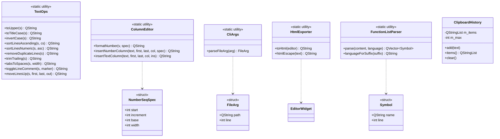
```mermaid
classDiagram
    class TextOps {
        <<static utility>>
        +toUpper(s) QString
        +toTitleCase(s) QString
        +invertCase(s) QString
        +sortLinesAscending(s, cs) QString
        +sortLinesNumeric(s, asc) QString
        +removeDuplicateLines(s) QString
        +trimTrailing(s) QString
        +tabsToSpaces(s, width) QString
        +toggleLineComment(s, marker) QString
        +moveLinesUp(s, first, last, out) QString
    }
    class ColumnEditor {
        <<static utility>>
        +formatNumber(v, spec) QString
        +insertNumberColumn(text, first, last, col, spec) QString
        +insertTextColumn(text, first, last, col, ins) QString
    }
    class NumberSeqSpec {
        <<struct>>
        +int start
        +int increment
        +int base
        +int width
    }
    class CliArgs {
        <<static utility>>
        +parseFileArg(arg) FileArg
    }
    class FileArg {
        <<struct>>
        +QString path
        +int line
    }
    class HtmlExporter {
        <<static utility>>
        +toHtml(editor) QString
        +htmlEscape(text) QString
    }
    class FunctionListParser {
        <<static utility>>
        +parse(content, language) QVector~Symbol~
        +languageForSuffix(suffix) QString
    }
    class Symbol {
        <<struct>>
        +QString name
        +int line
    }
    class ClipboardHistory {
        -QStringList m_items
        -int m_max
        +add(text)
        +items() QStringList
        +clear()
    }
    ColumnEditor ..> NumberSeqSpec
    CliArgs ..> FileArg
    FunctionListParser ..> Symbol
    HtmlExporter ..> EditorWidget
```

### 6.4 persistence + platform

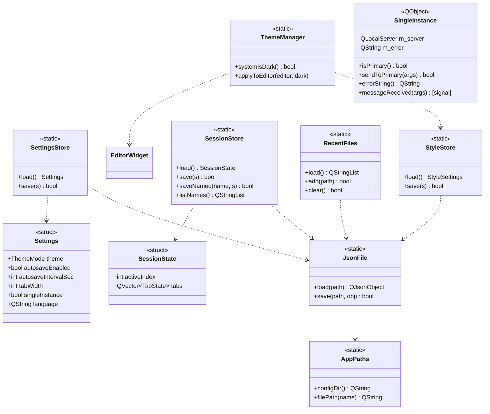
```mermaid
classDiagram
    class AppPaths {
        <<static>>
        +configDir() QString
        +filePath(name) QString
    }
    class JsonFile {
        <<static>>
        +load(path) QJsonObject
        +save(path, obj) bool
    }
    class SettingsStore {
        <<static>>
        +load() Settings
        +save(s) bool
    }
    class Settings {
        <<struct>>
        +ThemeMode theme
        +bool autosaveEnabled
        +int autosaveIntervalSec
        +int tabWidth
        +bool singleInstance
        +QString language
    }
    class StyleStore {
        <<static>>
        +load() StyleSettings
        +save(s) bool
    }
    class SessionStore {
        <<static>>
        +load() SessionState
        +save(s) bool
        +saveNamed(name, s) bool
        +listNames() QStringList
    }
    class SessionState {
        <<struct>>
        +int activeIndex
        +QVector~TabState~ tabs
    }
    class RecentFiles {
        <<static>>
        +load() QStringList
        +add(path) bool
        +clear() bool
    }
    class ThemeManager {
        <<static>>
        +systemIsDark() bool
        +applyToEditor(editor, dark)
    }
    class SingleInstance {
        <<QObject>>
        -QLocalServer m_server
        -QString m_error
        +isPrimary() bool
        +sendToPrimary(args) bool
        +errorString() QString
        +messageReceived(args) [signal]
    }

    SettingsStore ..> JsonFile
    StyleStore ..> JsonFile
    SessionStore ..> JsonFile
    RecentFiles ..> JsonFile
    JsonFile ..> AppPaths
    SettingsStore ..> Settings
    SessionStore ..> SessionState
    ThemeManager ..> StyleStore
    ThemeManager ..> EditorWidget
```

### 6.5 The extension protocol

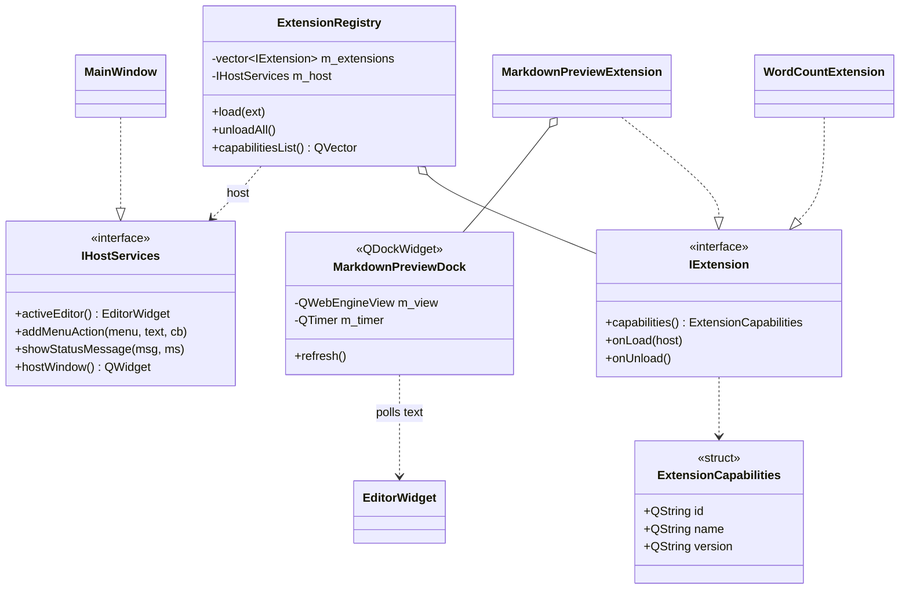
```mermaid
classDiagram
    class IHostServices {
        <<interface>>
        +activeEditor() EditorWidget
        +addMenuAction(menu, text, cb)
        +showStatusMessage(msg, ms)
        +hostWindow() QWidget
    }
    class IExtension {
        <<interface>>
        +capabilities() ExtensionCapabilities
        +onLoad(host)
        +onUnload()
    }
    class ExtensionCapabilities {
        <<struct>>
        +QString id
        +QString name
        +QString version
    }
    class ExtensionRegistry {
        -vector~IExtension~ m_extensions
        -IHostServices m_host
        +load(ext)
        +unloadAll()
        +capabilitiesList() QVector
    }
    class MainWindow
    class WordCountExtension
    class MarkdownPreviewExtension
    class MarkdownPreviewDock {
        <<QDockWidget>>
        -QWebEngineView m_view
        -QTimer m_timer
        +refresh()
    }

    MainWindow ..|> IHostServices
    WordCountExtension ..|> IExtension
    MarkdownPreviewExtension ..|> IExtension
    ExtensionRegistry o-- IExtension
    ExtensionRegistry ..> IHostServices : host
    IExtension ..> ExtensionCapabilities
    MarkdownPreviewExtension o-- MarkdownPreviewDock
    MarkdownPreviewDock ..> EditorWidget : polls text
```

### 6.6 ui: dock → MainWindow signal feedback

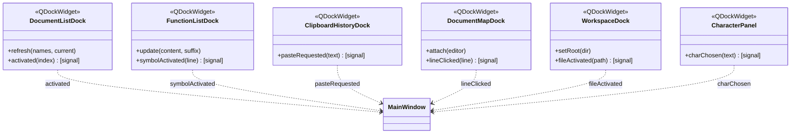
```mermaid
classDiagram
    class MainWindow
    class DocumentListDock {
        <<QDockWidget>>
        +refresh(names, current)
        +activated(index) [signal]
    }
    class FunctionListDock {
        <<QDockWidget>>
        +update(content, suffix)
        +symbolActivated(line) [signal]
    }
    class ClipboardHistoryDock {
        <<QDockWidget>>
        +pasteRequested(text) [signal]
    }
    class DocumentMapDock {
        <<QDockWidget>>
        +attach(editor)
        +lineClicked(line) [signal]
    }
    class WorkspaceDock {
        <<QDockWidget>>
        +setRoot(dir)
        +fileActivated(path) [signal]
    }
    class CharacterPanel {
        <<QDockWidget>>
        +charChosen(text) [signal]
    }
    DocumentListDock ..> MainWindow : activated
    FunctionListDock ..> MainWindow : symbolActivated
    ClipboardHistoryDock ..> MainWindow : pasteRequested
    DocumentMapDock ..> MainWindow : lineClicked
    WorkspaceDock ..> MainWindow : fileActivated
    CharacterPanel ..> MainWindow : charChosen
```

---

## 7. Sequence diagrams for the main features

### 7.1 Opening a file + encoding detection + applying a lexer

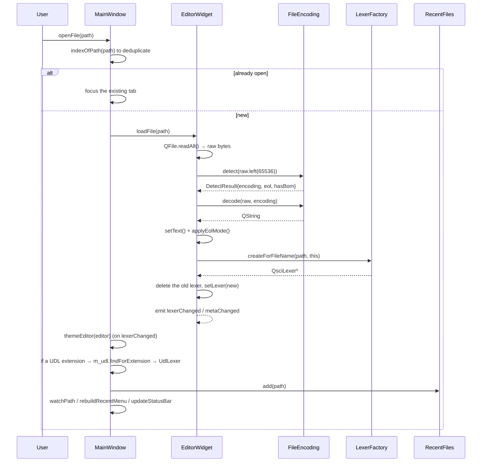
```mermaid
sequenceDiagram
    participant User
    participant MW as MainWindow
    participant EW as EditorWidget
    participant FE as FileEncoding
    participant LF as LexerFactory
    participant RF as RecentFiles

    User->>MW: openFile(path)
    MW->>MW: indexOfPath(path) to deduplicate
    alt already open
        MW->>MW: focus the existing tab
    else new
        MW->>EW: loadFile(path)
        EW->>EW: QFile.readAll() → raw bytes
        EW->>FE: detect(raw.left(65536))
        FE-->>EW: DetectResult{encoding, eol, hasBom}
        EW->>FE: decode(raw, encoding)
        FE-->>EW: QString
        EW->>EW: setText() + applyEolMode()
        EW->>LF: createForFileName(path, this)
        LF-->>EW: QsciLexer*
        EW->>EW: delete the old lexer, setLexer(new)
        EW-->>EW: emit lexerChanged / metaChanged
        MW->>MW: themeEditor(editor) (on lexerChanged)
        MW->>MW: if a UDL extension → m_udl.findForExtension → UdlLexer
        MW->>RF: add(path)
        MW->>MW: watchPath / rebuildRecentMenu / updateStatusBar
    end
```

### 7.2 Saving (including legacy encodings)

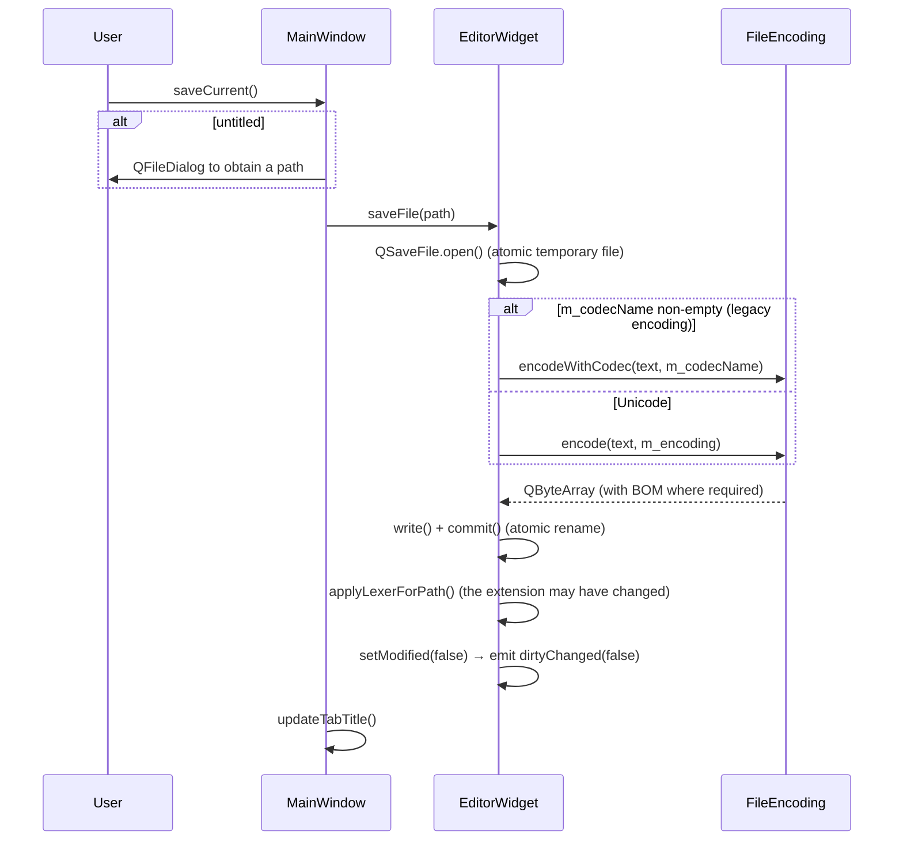
```mermaid
sequenceDiagram
    participant User
    participant MW as MainWindow
    participant EW as EditorWidget
    participant FE as FileEncoding

    User->>MW: saveCurrent()
    alt untitled
        MW->>User: QFileDialog to obtain a path
    end
    MW->>EW: saveFile(path)
    EW->>EW: QSaveFile.open() (atomic temporary file)
    alt m_codecName non-empty (legacy encoding)
        EW->>FE: encodeWithCodec(text, m_codecName)
    else Unicode
        EW->>FE: encode(text, m_encoding)
    end
    FE-->>EW: QByteArray (with BOM where required)
    EW->>EW: write() + commit() (atomic rename)
    EW->>EW: applyLexerForPath() (the extension may have changed)
    EW->>EW: setModified(false) → emit dirtyChanged(false)
    MW->>MW: updateTabTitle()
```

### 7.3 Search: the Replace One guard + Find in Files in the background

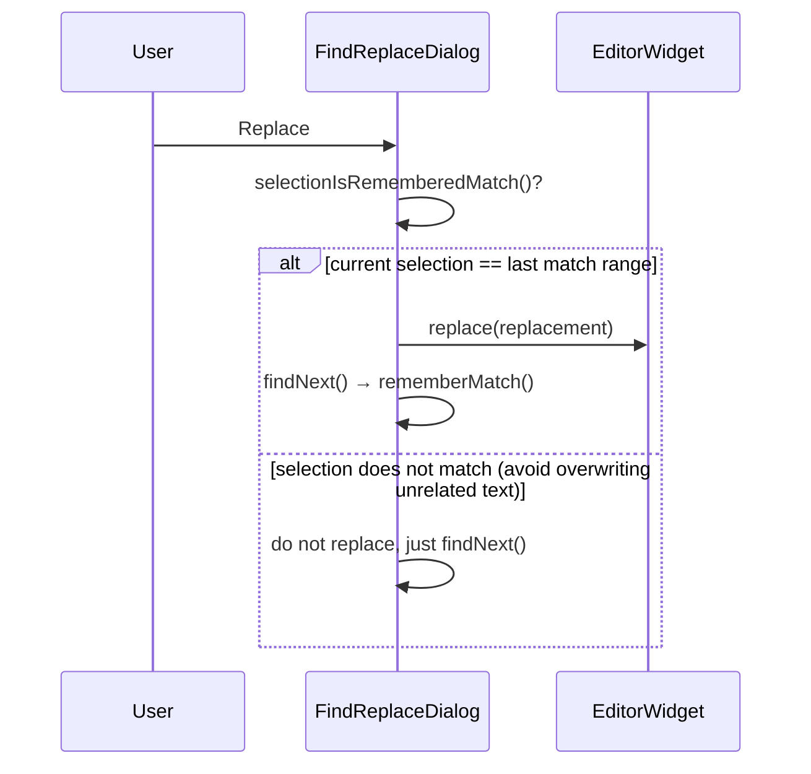
```mermaid
sequenceDiagram
    participant User
    participant FRD as FindReplaceDialog
    participant EW as EditorWidget

    User->>FRD: Replace
    FRD->>FRD: selectionIsRememberedMatch()?
    alt current selection == last match range
        FRD->>EW: replace(replacement)
        FRD->>FRD: findNext() → rememberMatch()
    else selection does not match (avoid overwriting unrelated text)
        FRD->>FRD: do not replace, just findNext()
    end
```

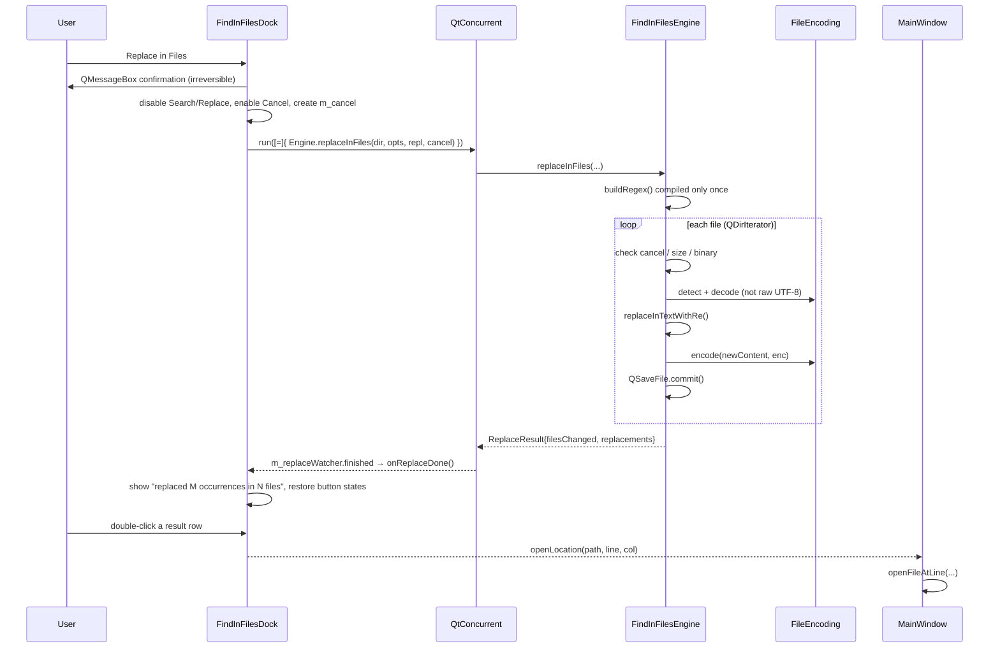
```mermaid
sequenceDiagram
    participant User
    participant Dock as FindInFilesDock
    participant QC as QtConcurrent
    participant Eng as FindInFilesEngine
    participant FE as FileEncoding
    participant MW as MainWindow

    User->>Dock: Replace in Files
    Dock->>User: QMessageBox confirmation (irreversible)
    Dock->>Dock: disable Search/Replace, enable Cancel, create m_cancel
    Dock->>QC: run([=]{ Engine.replaceInFiles(dir, opts, repl, cancel) })
    QC->>Eng: replaceInFiles(...)
    Eng->>Eng: buildRegex() compiled only once
    loop each file (QDirIterator)
        Eng->>Eng: check cancel / size / binary
        Eng->>FE: detect + decode (not raw UTF-8)
        Eng->>Eng: replaceInTextWithRe()
        Eng->>FE: encode(newContent, enc)
        Eng->>Eng: QSaveFile.commit()
    end
    Eng-->>QC: ReplaceResult{filesChanged, replacements}
    QC-->>Dock: m_replaceWatcher.finished → onReplaceDone()
    Dock->>Dock: show "replaced M occurrences in N files", restore button states
    User->>Dock: double-click a result row
    Dock-->>MW: openLocation(path, line, col)
    MW->>MW: openFileAtLine(...)
```

### 7.4 Loading an extension and live Markdown preview

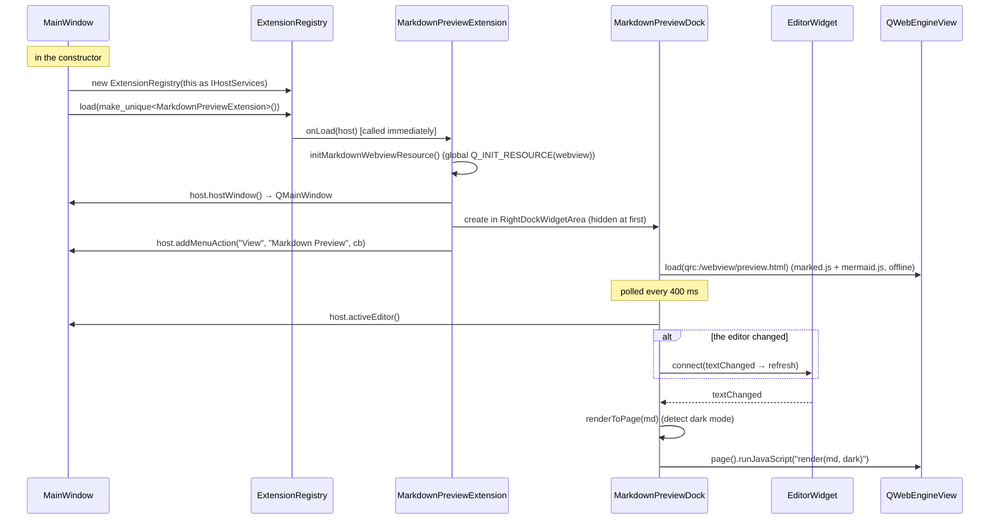
```mermaid
sequenceDiagram
    participant MW as MainWindow
    participant Reg as ExtensionRegistry
    participant Ext as MarkdownPreviewExtension
    participant Dock as MarkdownPreviewDock
    participant EW as EditorWidget
    participant Web as QWebEngineView

    Note over MW: in the constructor
    MW->>Reg: new ExtensionRegistry(this as IHostServices)
    MW->>Reg: load(make_unique<MarkdownPreviewExtension>())
    Reg->>Ext: onLoad(host)  [called immediately]
    Ext->>Ext: initMarkdownWebviewResource() (global Q_INIT_RESOURCE(webview))
    Ext->>MW: host.hostWindow() → QMainWindow
    Ext->>Dock: create in RightDockWidgetArea (hidden at first)
    Ext->>MW: host.addMenuAction("View", "Markdown Preview", cb)
    Dock->>Web: load(qrc:/webview/preview.html) (marked.js + mermaid.js, offline)

    Note over Dock: polled every 400 ms
    Dock->>MW: host.activeEditor()
    alt the editor changed
        Dock->>EW: connect(textChanged → refresh)
    end
    EW-->>Dock: textChanged
    Dock->>Dock: renderToPage(md) (detect dark mode)
    Dock->>Web: page().runJavaScript("render(md, dark)")
```

### 7.5 Applying a theme (dark/light + colour softening + user overrides)

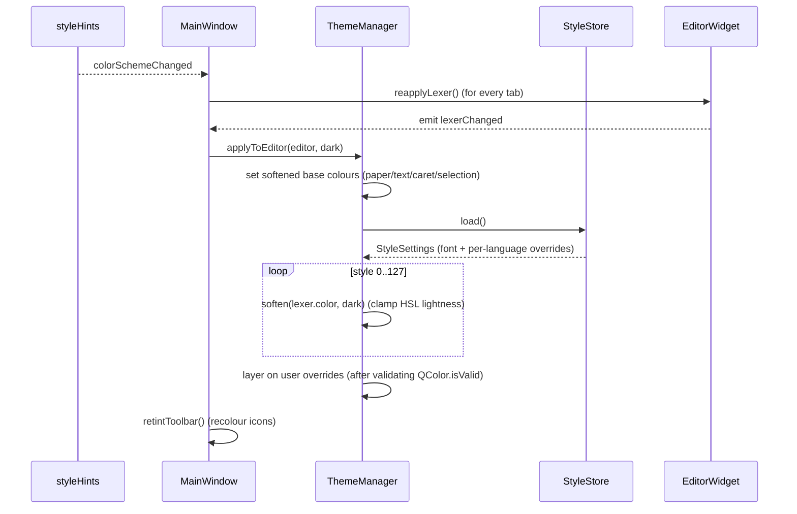
```mermaid
sequenceDiagram
    participant Sys as styleHints
    participant MW as MainWindow
    participant TM as ThemeManager
    participant SS as StyleStore
    participant EW as EditorWidget

    Sys-->>MW: colorSchemeChanged
    MW->>EW: reapplyLexer() (for every tab)
    EW-->>MW: emit lexerChanged
    MW->>TM: applyToEditor(editor, dark)
    TM->>TM: set softened base colours (paper/text/caret/selection)
    TM->>SS: load()
    SS-->>TM: StyleSettings (font + per-language overrides)
    loop style 0..127
        TM->>TM: soften(lexer.color, dark) (clamp HSL lightness)
    end
    TM->>TM: layer on user overrides (after validating QColor.isValid)
    MW->>MW: retintToolbar() (recolour icons)
```

### 7.6 Session save / restore, and single-instance forwarding

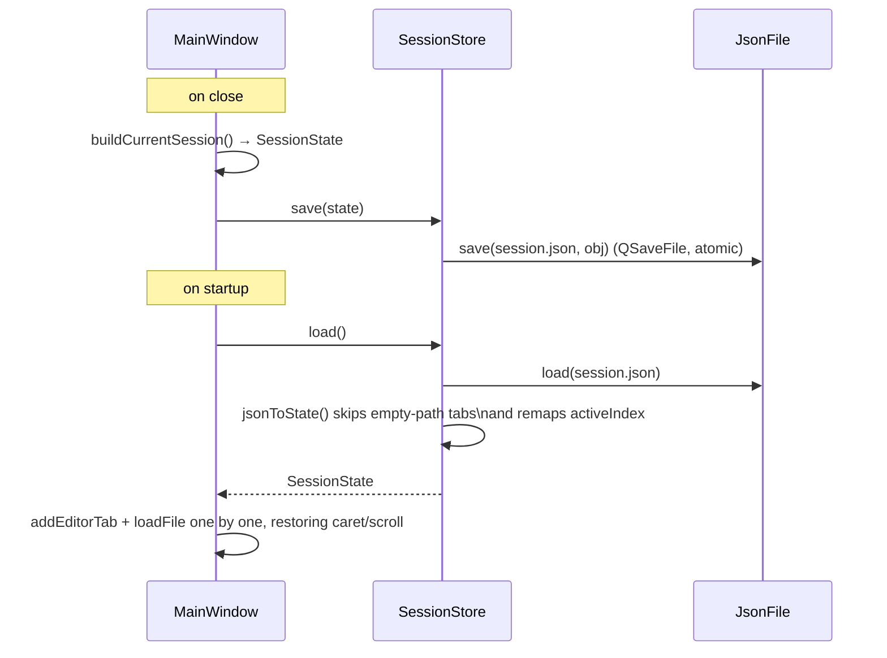
```mermaid
sequenceDiagram
    participant MW as MainWindow
    participant SES as SessionStore
    participant JF as JsonFile

    Note over MW: on close
    MW->>MW: buildCurrentSession() → SessionState
    MW->>SES: save(state)
    SES->>JF: save(session.json, obj) (QSaveFile, atomic)

    Note over MW: on startup
    MW->>SES: load()
    SES->>JF: load(session.json)
    SES->>SES: jsonToState() skips empty-path tabs\nand remaps activeIndex
    SES-->>MW: SessionState
    MW->>MW: addEditorTab + loadFile one by one, restoring caret/scroll
```

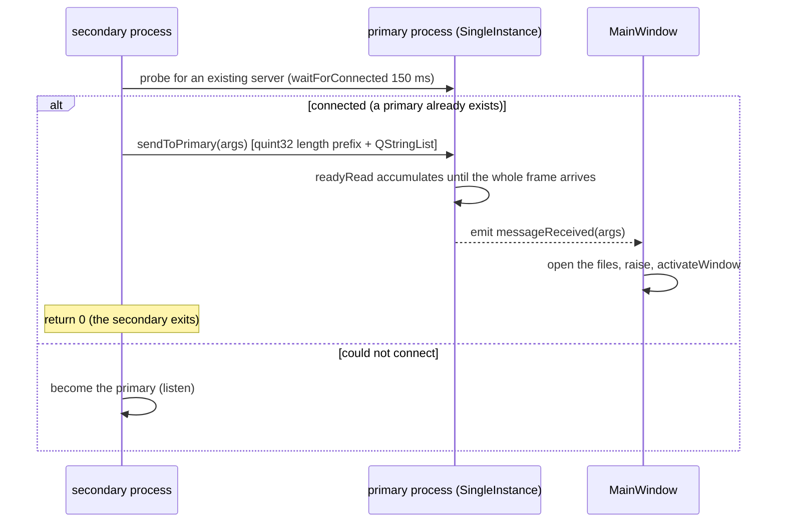
```mermaid
sequenceDiagram
    participant S as secondary process
    participant P as primary process (SingleInstance)
    participant MW as MainWindow

    S->>P: probe for an existing server (waitForConnected 150 ms)
    alt connected (a primary already exists)
        S->>P: sendToPrimary(args) [quint32 length prefix + QStringList]
        P->>P: readyRead accumulates until the whole frame arrives
        P-->>MW: emit messageReceived(args)
        MW->>MW: open the files, raise, activateWindow
        Note over S: return 0 (the secondary exits)
    else could not connect
        S->>S: become the primary (listen)
    end
```

### 7.7 Macro record / playback

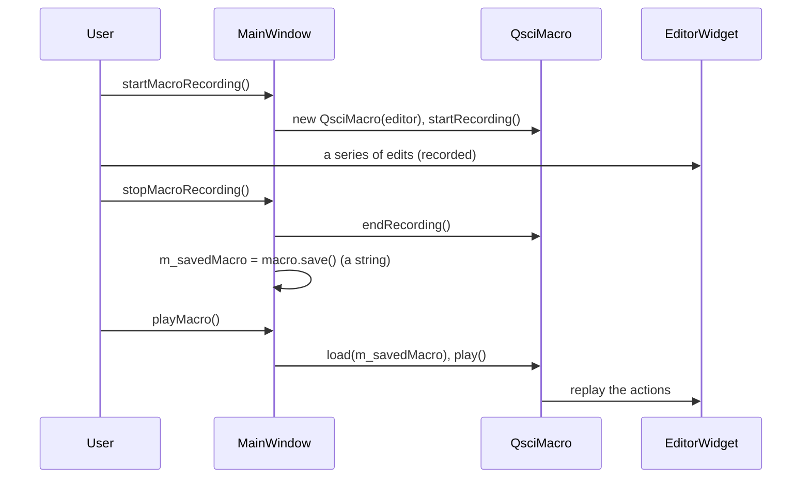
```mermaid
sequenceDiagram
    participant User
    participant MW as MainWindow
    participant Macro as QsciMacro
    participant EW as EditorWidget

    User->>MW: startMacroRecording()
    MW->>Macro: new QsciMacro(editor), startRecording()
    User->>EW: a series of edits (recorded)
    User->>MW: stopMacroRecording()
    MW->>Macro: endRecording()
    MW->>MW: m_savedMacro = macro.save() (a string)
    User->>MW: playMacro()
    MW->>Macro: load(m_savedMacro), play()
    Macro->>EW: replay the actions
```

---

## 8. Feature flow analysis

### 8.1 Tabbed editing (FR-001/002)
Each tab is an `EditorPane` containing a primary `EditorWidget` (which holds the file state) and, when
split, a secondary `QsciScintilla` (**sharing the same `QsciDocument`**, with independent caret and
scroll). `toggleSplit()` creates or tears down the secondary and connects four scroll-sync lambdas
(stored in `m_syncConns` and disconnected on teardown to avoid a dangling `QScrollBar`; `m_syncing`
prevents recursion). Closing a tab goes through `maybeSave` (Save/Discard/Cancel), and the close path
pushes onto `m_closedFiles` (for Restore Recent Closed).

### 8.2 File I/O and encoding (FR-014/019/020)
Loading: raw bytes → `FileEncoding::detect` (BOM sniff → strict UTF-8 probe → fall back to Latin-1;
EOL determined by the first line break) → `decode` → `setText`. Saving: atomic write via `QSaveFile`,
choosing `encodeWithCodec`/`encode` according to `m_codecName`/`m_encoding` (adding a BOM where
needed). **Character sets**: `characterSets()` provides about 32 legacy encodings in 13 regional
groups, reinterpreted through `QTextCodec` by `reinterpretWithCodec` (which first verifies the codec
exists and otherwise fails loudly rather than silently falling back to UTF-8).

### 8.3 Syntax highlighting and UDL (FR-006/007)
`LexerFactory` maps extension / filename / language key to 30+ built-in `QsciLexer`s; the old lexer is
deleted before `setLexer` (to avoid accumulating leaks). Custom languages: `UdlDefinition` (the data
model) → `UdlManager` stores them in `udl/*.json` (filenames sanitised with Unicode `\w`, preserving
CJK names so they do not collapse into the same name) → `UdlLexer` (a `QsciLexerCustom`) **rescans the
whole document from the start** in `styleText` (because block comment state spans lines and Scintilla
cannot tell from `start` alone whether it is inside a comment; `\"` escapes are handled too).

### 8.4 The search family (FR-010/011/012/013)
- **Find/Replace** (`FindReplaceDialog`, modeless): drives
  `EditorWidget::findFirst/replace/replaceAll/markAll`; regex uses C++11 `std::regex`. The **Replace
  One guard**: replacement happens only when the current selection equals the last match range
  (`rememberMatch`/`selectionIsRememberedMatch` plus 4 ints), so a manual user selection is never
  overwritten. Incremental search wrapping follows the checkbox state.
- **Find in Files** (`FindInFilesEngine` static, `FindInFilesDock` UI): both search and replace run in
  the background with `QtConcurrent::run`, an `std::atomic<bool>` cancel flag and a `QFutureWatcher` to
  collect the result; the regex is **compiled only once per run**; reads and writes go **through
  `FileEncoding`'s detected-encoding round-trip** (no longer raw UTF-8, which used to corrupt
  non-UTF-8 files). Double-clicking a result → `openLocation` → `MainWindow::openFileAtLine`.

### 8.5 Editing operations and column editing (the Edit menu)
`TextOps` provides pure `QString→QString` transformations for case, sorting, deduplication, trimming
and indentation conversion; `ColumnEditor` provides rectangular insertion of incrementing number series
(`NumberSeqSpec`, supporting base 10/16/8/2 and zero padding). `EditorWidget` additionally offers
folding (`foldAllBlocks/foldToLevel/foldCurrent`), block comments (choosing tokens by lexer language)
and advanced bookmark operations (keep/remove/invert/extract bookmarked lines).

### 8.6 View panels (FR-026/029/030)
DocumentList (tab switching), FunctionList (symbol extraction by regex in `FunctionListParser`),
ClipboardHistory (listening to `qApp->clipboard()`), DocumentMap (a thumbnail sharing the document,
`zoomTo(-8)`), Workspace (a `QFileSystemModel` folder tree) and CharacterPanel (a 256-character table).
Each dock signals back to MainWindow (`activated` / `symbolActivated` / `pasteRequested` /
`lineClicked` / `fileActivated` / `charChosen`).

### 8.7 Running external commands (FR-031)
`RunCommand::expand` substitutes variables such as `$(FULL_CURRENT_PATH)` in a single linear pass (so a
substituted value is never rescanned by a later marker); `tokenize` respects the user's quoting to
produce argv. `RunDock` tokenises the raw template first and then expands each token (so expanded
values are not re-split), executing via `QProcess` (argv array, no shell → no injection) and streaming
the output.

### 8.8 Themes and styles (FR-021/034)
`ThemeManager::soften` desaturates colours in HSL space (×0.55) and clamps lightness (155–205 for dark,
70–120 for light) so that any lexer palette stays readable on either background; user overrides from
`StyleStore` are then layered on top (validated with `QColor::isValid` first). System appearance
changes are re-applied immediately via `styleHints()::colorSchemeChanged`, followed by
`retintToolbar()`.

### 8.9 Persistence and sessions (FR-016)
All settings go through `JsonFile` (atomic `QSaveFile` writes, tolerant loading that falls back to an
empty object). `SessionStore` records each tab's path/caret/scroll plus the activeIndex (skipping
empty-path tabs on restore and **remapping activeIndex**); named session filenames carry the **first 8
characters of a SHA-1** to avoid collisions. `RecentFiles` is a 20-entry MRU whose `add`/`clear` return
`bool`, per IL-4 (fail fast, fail loudly).

### 8.10 The plugin protocol (FR-035/037)
`MainWindow` also implements `IHostServices`. `ExtensionRegistry::load` takes ownership and calls
`onLoad(host)` **immediately**. The built-ins are WordCount (Edit menu, code-point-based counting) and
MarkdownPreview (a `QWebEngineView` loading `qrc:/webview/preview.html`, polling activeEditor and
listening to textChanged, rendering Mermaid offline with `runJavaScript("render(md,dark)")`).
`addMenuAction` matches menus by `objectName` (translation changes the title, so the title cannot be
used).

### 8.11 Internationalisation (i18n)
`main.cpp` resolves the language from `settings.language` / the system locale and installs a
`QTranslator` **before constructing `MainWindow`** (the menus are created in the constructor, so
installing later would leave them untranslated). Four locales: `zh_TW`/`zh_CN`/`ja`/`en`, packaged in
`i18n.qrc`.

---

## 9. Key design decisions

| # | Decision | Rationale / trade-off |
|---|----------|-----------------------|
| D-1 | **Static library `macpad_lib` + thin shell executable** | Lets QtTest link the core logic directly; the cost is that `.qrc` needs manual `Q_INIT_RESOURCE`. |
| D-2 | **Core/GUI separation, many stateless static utility classes** | Pure logic (encoding, the search engine, text operations, persistence) is testable without a GUI; the GUI classes stay thin. |
| D-3 | **An in-process extension protocol instead of DLL plugins** | macOS cannot load Windows `.dll`s; `IExtension`/`IHostServices` provide a restricted, stable (CON-007 frozen) interface. |
| D-4 | **JSON + atomic `QSaveFile` writes** | A crash or power loss does not corrupt settings; loading tolerates errors by returning an empty object. |
| D-5 | **Legacy encodings via Qt6 Core5Compat (`QTextCodec`)** | Reproduces Notepad++'s Character sets while staying portable; Unicode paths use the modern `QStringConverter`. |
| D-6 | **HSL colour softening rather than swapping palettes** | Any lexer palette stays readable on either background, while respecting the user's `StyleStore` overrides. |
| D-7 | **UTF-8 internally + byte offsets** | Matches Scintilla natively; the cost is that identifier and character handling must account for multi-byte sequences (call tips and counting have been fixed accordingly). |
| D-8 | **The UDL lexer rescans the whole document** | Correctly handles block comments spanning lines; the cost is rescanning large files (acceptable, as UDL covers few languages). |
| D-9 | **Length-prefixed framing for single-instance IPC** | `QLocalSocket`'s `readyRead` can arrive in fragments; this avoids a `QDataStream` underflow silently dropping arguments. |
| D-10 | **Locating menus by `objectName`** | i18n changes `title()`, so only a stable English key avoids building duplicate translated menus. |

> Major technology choices and major contract version bumps warrant a separate ADR
> (`.decisions/ADR_{N}_{SLUG}.md`; see constitution §13).

---

## 10. Quality and testing

- **Tests**: 17 QtTest suites (`QT_QPA_PLATFORM=offscreen`), plus the `bench_largefile` performance
  benchmark. All green, zero warnings under `-Werror`.
- **Coverage strategy**: "test the pure logic, do not test the GUI". Measured line coverage over `src/`
  is about **22%**; it varies sharply by layer: persistence ~75%, core/features ~54%, and
  app/ui/platform ≈ 0% (no GUI test instantiates `MainWindow`, the dialogs, `ThemeManager` or
  `SingleInstance`).
- **Gap**: constitution §10 requires ≥80% unit test coverage, which is not met yet. Suggested
  priorities: `RunCommand`, `FileEncoding` codec round-trips, the `SingleInstance` message framing,
  `ThemeManager::soften`, and instantiating `MainWindow` offscreen to test toolbar/menu synchronisation
  and autosave clamping.

---

## 11. Appendix: directory structure

```
src/
├── app/           main.cpp (startup sequence), MainWindow (coordinator + IHostServices)
├── core/          EditorWidget, FileEncoding, LexerFactory
├── features/
│   ├── search/           FindReplaceDialog
│   ├── findinfiles/      FindInFilesEngine (static), FindInFilesDock
│   ├── udl/              UdlDefinition, UdlLexer, UdlManager
│   ├── run/              RunCommand (static), RunDock
│   ├── textops/          TextOps (static)
│   ├── columneditor/     ColumnEditor (static)
│   ├── export/           HtmlExporter (static)
│   ├── functionlist/     FunctionListParser (static)
│   ├── clipboard/        ClipboardHistory
│   └── cli/              CliArgs (static)
├── persistence/   AppPaths, JsonFile, SettingsStore, StyleStore, SessionStore, RecentFiles
├── platform/      ThemeManager, SingleInstance
├── ui/            EditorPane, DocumentListDock, panels (Function/Clipboard/DocumentMap),
│                  WorkspaceDock, CharacterPanel, the dialogs
└── extension/     IExtension/IHostServices, ExtensionRegistry, builtin/{WordCount,MarkdownPreview}

resources/  icon/ (.icns/.svg), icons/ (toolbar SVGs), i18n/ (.ts/.qm), webview/ (marked+mermaid)
docs/       design.md (this file), parity.md, plugin-development.md
tests/      unit/ (17 suites), benchmark/
```

---

*This design document was synthesised by six parallel code-exploration agents extracting structure from
the actual sources, reflecting the state after commit `17f10cc`. It should be updated as the code
evolves.*

---

## 12. Sprint 1 — Design for the parity gaps

> Corresponds to PRD v1.1.0 appendix A (FR-038..FR-052), SRS §9, ModuleInterfaces §7. This section
> records the design added in Sprint 1 to narrow the gap with Notepad++. Every change is **additive**
> and does not alter existing module boundaries.

### 12.1 Design principles
- **Pure logic first**: text/sorting/column/CLI/session work is implemented as stateless static
  functions or plain data structs, preserving high testability (continuing the existing 65%→91%
  coverage strategy).
- **Additively compatible**: new methods and fields carry defaults; existing public signatures and the
  25 existing tests are untouched.
- **UI wiring concentrated in the app layer**: core methods are surfaced by `MainWindow` through menus
  and dialogs; core modules never depend back on app.

### 12.2 Additions per module

| Module | Added | FR |
|--------|-------|----|
| `TextOps` | toRandomCase / removeConsecutiveDuplicateLines / shuffleLines / sortLinesLocale / sortLinesByLength / sortLinesAsDecimals / trimBoth / eolToSpace / spacesToTabsLeading | 038–041 |
| `ColumnEditor` | insertTextColumn wired up + formatNumber honouring upperHex | 042 |
| `FindInFilesEngine` | FindInFilesOptions.includeHidden / excludeFilters + isExcluded() | 045 |
| `EditorWidget` | countMatches / reinterpretAsEncoding / cutBookmarkedLines / pasteReplaceBookmarkedLines / setAutoClose+closerFor / replaceAll(dotAll) overload / AcsDocument autocompletion | 043/044/047/048/049/050 |
| `FindReplaceDialog` | Count button / swap fields / in-selection / dot-all checkbox | 043/044 |
| `CliArgs` | FileArg.column + ParsedArgs + parse() | 051 |
| `SessionStore` | TabState.selection / bookmarks / languageOverride | 052 |
| `MainWindow` | Edit/Search/Encoding menu wiring; main.cpp applies CliArgs::parse; cross-document replace loop | 040–052 |

### 12.3 Key design decisions (Sprint 1)
- **Randomised functions take a seed** (`toRandomCase`/`shuffleLines`): `std::mt19937` plus an optional
  seed parameter (random by default), so unit tests can assert deterministic output with a fixed seed.
- **`reinterpretAsEncoding` vs `reinterpretWithCodec`**: the former uses the built-in `Encoding` enum
  (UTF-8/16) and only re-decodes without transcoding (FR-050, mapping to Notepad++'s "Encode in…"); the
  latter uses `QTextCodec` for legacy encodings (the existing FR-019). Both coexist with distinct
  semantics.
- **Auto-pairing made testable**: the "typed character → matching closing character" decision is
  extracted into `static QChar EditorWidget::closerFor(QChar)` so the logic can be unit-tested without
  going through `keyPressEvent`; the `m_autoClose` switch preserves the existing `(` call-tip trigger.
- **`replaceAll` dot-all added as an overload**: the existing `replaceAll` signature is untouched; a new
  overload takes `bool dotAll` and changes `.`'s newline matching semantics only on that path
  (inverting `std::regex`'s `match_not_dotall`).
- **Session backward compatibility**: missing new fields fall back (old session files without
  `selection`/`bookmarks`/`language_override` keys use empty values), preserving the existing
  gap-skipping `activeIndex` remap fix.

### 12.4 Auto-pairing sequence

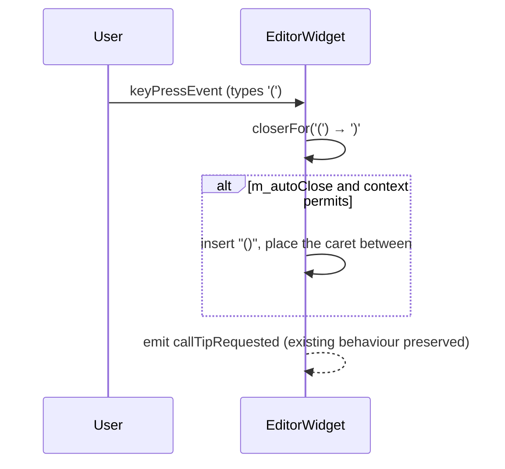
```mermaid
sequenceDiagram
    participant User
    participant EW as EditorWidget
    User->>EW: keyPressEvent (types '(')
    EW->>EW: closerFor('(') → ')'
    alt m_autoClose and context permits
        EW->>EW: insert "()", place the caret between
    end
    EW-->>EW: emit callTipRequested (existing behaviour preserved)
```

### 12.5 Not yet included (FR-053..FR-060, later sprints)
Complete Preferences categories, non-destructive backup / crash recovery, the advanced autocompletion
engine (API/function/path + XML definitions), a named multi-theme system, the Change History margin,
the in-document Find All results window, advanced UDL (multiple keyword groups / operators / delimiters
/ export / styler), Paste Special / the Multi-Select command set / virtual space. These are large
subsystems, documented in the PRD/SRS and deferred to later iterations.

---

*The Sprint 1 addendum (§12) reflects the first wave of parity gap implementation;
`docs/parity-audit.md`'s status was updated after implementation.*

---

## 13. Sprint 2 — Large subsystems (FR-053..FR-060)

> Corresponds to PRD v1.2.0 group B, SRS §10. Sprint 2 completed the large subsystems deferred earlier.
> The design continues the "pure logic first, additively compatible, UI wiring concentrated in the app
> layer" principles and carries as much as possible in **new modules/new files**, reducing coupling with
> existing code.

### 13.1 New modules and files

| Subsystem | FR | Main files (new/extended) |
|-----------|----|--------------------------|
| Advanced autocompletion engine | FR-055 | `features/autocomplete/ApiDatabase` (new; per-language keywords/functions/callTip/path) + `core/EditorWidget::applyApiCompletions` (QsciAPIs) |
| Named multi-theme system | FR-056 | `persistence/ThemeStore` (new, themes/*.json) + `platform/ThemeManager::applyNamedTheme` + `ui/ThemePickerDialog` (new) |
| Find All results window | FR-058 | `features/findall/FindAllEngine` (new, pure search) + `features/findall/FindAllDock` (new, results panel) |
| Non-destructive backup / crash recovery | FR-054 | `features/backup/BackupService` (new, .bak + snapshot) |
| Complete Preferences | FR-053 | `ui/PreferencesDialog` (reworked into category pages) + `persistence/SettingsStore` (extended fields) |
| Advanced UDL | FR-059 | `features/udl/*` (multiple keyword groups / operators / delimiters / folder / export) + `ui/UdlEditorDialog` |
| Change History / virtual space / multi-select | FR-057/060 | `core/EditorWidget` (Scintilla message wrappers) |
| On-Selection / Paste Special | FR-060 | `app/MainWindow` (menu wiring) |

### 13.2 Key design decisions (Sprint 2)
- **Wrapping Scintilla's advanced features** (FR-057/060): Change History, virtual space and
  Multiple-Selection-Add-Next are all native Scintilla 5 messages; EditorWidget wraps them with
  `SendScintilla(SCI_...)` and exposes high-level methods, defining `constexpr` constants in place where
  QScintilla does not export them, and safely no-opping when the capability is absent (version
  compatibility).
- **Separating autocompletion data from the engine** (FR-055): `ApiDatabase` (pure data/logic, fully
  unit-testable) is decoupled from `EditorWidget::applyApiCompletions` (the QsciAPIs binding, GUI);
  MainWindow feeds `ApiDatabase::entriesFor(lang)` to the editor on lexer change.
- **Themes as files** (FR-056): themes are stored as JSON (reusing the `StyleSettings` structure) under
  the config `themes/` directory, so they can be imported, exported and shared;
  `ThemeManager::applyNamedTheme` applies them. This coexists with the existing live dark/light
  softening (theme overrides win).
- **Deterministic backup testing** (FR-054): `BackupService`'s timestamp is passed in by the caller (it
  never reads the wall clock), so verbose filenames can be asserted in unit tests; snapshots go to the
  config `snapshots/` directory, and scanning `pendingSnapshots()` at startup implements crash recovery.
- **UDL backward compatibility** (FR-059): the `UdlDefinition` schema was versioned up; an old single
  `keywords` list loads as group 0, with multiple groups / operators / delimiters / folder added, and
  `fromJson` falling back for missing fields.

### 13.3 Find All data flow
```mermaid
flowchart LR
    MW[MainWindow] -->|contents of each open document| ENG[FindAllEngine.searchInText]
    ENG -->|QVector FindAllMatch| DOCK[FindAllDock.setResults]
    DOCK -->|double-click openLocation docId,line,col| MW
    MW -->|focus tab + position| EW[EditorWidget]
```

### 13.4 State on completion
After Sprint 2, group B (FR-053..060) in `docs/parity-audit.md` moved from missing/partial to
implemented; what remained were the `na_macos` items (Windows DLL plugins, registry file associations,
MIME tools and other platform-impossible items).

---

*The Sprint 2 addendum (§13) completed the large subsystems; status was synchronised to
`docs/parity-audit.md` and `sprint/current/status.md` after implementation.*

### 13.5 Sprint 3 wrap-up (FR-053/FR-054 completed)
Clearing the TODOs left by Sprint 2 so that both subsystems are genuinely complete:
- **Preferences applied live**: `EditorWidget` gained
  `setShowLineNumbers`/`setCaretWidth`(override)/`setWordCompletionEnabled`/`setCallTipsEnabled`
  (with an `m_callTips` guard on the `(` call tip). MainWindow gained
  `applyEditorPrefs(editor, settings)`, called both when applying Preferences and from `addEditorTab`,
  so existing and new tabs alike get tabWidth / line numbers / caret width / auto-pairing /
  autocompletion / threshold / call tips / view preferences applied consistently.
- **Crash recovery made real**: `writeSnapshot` was previously never called (the mechanism idled). A
  30-second periodic `QTimer` was added to call `BackupService::writeSnapshot` for dirty tabs; if
  `pendingSnapshots()` is non-empty at startup, a `SnapshotRecoveryDialog` opens (multi-select restore /
  discard all), replacing the previous information box; `closeEvent` clears snapshots on a normal exit.
- **Large-file guard** (`largeFileMB`): `openFile` confirms first past the threshold. **Autosave on
  focus loss** (`autosaveOnFocusLoss`): saves dirty named tabs when `applicationStateChanged` reports
  non-active.
- Verification: CTest 30/30, zero warnings under `-Werror`, functional coverage 90.5%.

---

## 14. Sprint 4 — Structural gaps (FR-061..FR-064)

> Corresponds to PRD v1.3.0 group C, SRS §11 and `docs/parity-audit.md` (the 2026-07-08 review). The
> highest-return structural gaps.

### 14.1 Design per item
- **FR-061 Find in Files UI + path completion**: the review found that `FindInFilesEngine`'s
  `includeHidden`/`excludeFilters` had long been implemented and tested but were never exposed in the
  `FindInFilesDock` UI (wasted work). Checkboxes and input fields were added and read in
  `currentOptions()`. Likewise `ApiDatabase::completePath()` was an unwired function; a shortcut trigger
  plus `showUserList` display were added in `EditorWidget`.
- **FR-062 dual-view architecture** (the largest structural gap): MainWindow's centre became
  `QSplitter{ m_tabs, m_tabs2 }`, with the second view hidden by default; the active view is tracked and
  `currentPane`/`currentEditor`/status bar/panels follow it; "Move to Other View" moves a tab and "Clone
  to Other View" creates a view sharing the same `QsciDocument`; an empty view hides itself. With a
  single view, behaviour is identical to before.
- **FR-063 UDL styler**: `UdlDefinition` gained a per-style `UdlStyle{fg,bg,bold,italic,underline}`,
  applied by `UdlLexer` (falling back to `defaultColor` when unset), with colour/font editing in
  `UdlEditorDialog`. fromJson/toJson stay backward compatible.
- **FR-064 Global Styles**: `StyleSettings` gained `GlobalStyles` (indent guides / caret line /
  selection / whitespace / margin colours), layered on after the lexer colours by
  `ThemeManager::applyToEditor` (invalid colours skipped), with a "Global Styles" category added to
  `StyleConfiguratorDialog`.

### 14.2 Dual-view architecture
```mermaid
flowchart TB
    MW[MainWindow] --> SP[central QSplitter]
    SP --> V1["View 1: QTabWidget m_tabs"]
    SP --> V2["View 2: QTabWidget m_tabs2 (hidden by default)"]
    V1 --> P1[EditorPane…]
    V2 --> P2[EditorPane…]
    MW -. tracks the active view .-> V1
    MW -. Move/Clone to Other View .-> V2
```

> After Sprint 4, the structural gaps from the parity review (dual view, UDL styles, Global Styles,
> Find in Files UI) moved from missing/partial to full.

---

## 15. Sprint 5 — Clearing the long tail

> Goal: clear **every implementable** missing/partial item remaining from the 2026-07-08 review (except
> na_macos). Implemented by 12 module-level agents in parallel plus MainWindow wiring.

### 15.1 Items implemented
| Module | Added |
|--------|-------|
| TextOps | Proper Case / Sentence Case (blended, preserving the rest of the casing) |
| EditorWidget | Begin/End Select (including column mode), Redact Selection (● masking), smart highlighting (auto-highlight the word at the caret), Style Token (5-colour multi-group marking), HTML/XML tag auto-close |
| FindReplaceDialog | Extended mode (`\n\r\t\0\xNN`), dialog transparency, Volatile Find Next/Prev |
| FunctionList | Class/namespace nested tree, filter box, A-Z sorting |
| DocumentMap | Visible-range highlight box |
| CharacterPanel | Enter key inserts |
| RunDock | Command history dropdown, browse button, variable insertion menu |
| CliArgs | `-p`, `-l`, `-alwaysOnTop`, `-title`, `-quickPrint` and other flags |
| MimeTools (new) | Base64 / URL encode-decode |
| DocumentList | A-Z sorting, context menu, middle-click close, tab colours |
| Workspace | Multiple root folders, context menu (add / remove / find here / Finder) |
| Preferences | Highlighting page, Dark Mode / appearance page + the corresponding Settings fields |
| ShortcutMapper | Shortcut conflict detection, filter box |

### 15.2 Remaining (na_macos / design trade-offs)
Windows DLL plugins and Plugins Admin, registry file associations, legacy/easter-egg CLI flags, UDL
nesting (complex recursive inclusion, deferred after evaluation), and a user-editable
`functionList.xml` parser definition file (this project substitutes built-in parsing plus a tree and
filter, rather than an XML configuration file).

---

## 16. Sprint 6 — Audit-driven gap clearing

> Corresponds to the stricter 8-area item-by-item audit of 2026-07-08 (204 items: full 130 / partial 41
> / missing 27 / na_macos 6).
> The audit's conclusion: **no pillar-level functionality was wholly absent**; what remained were
> value-add options and long-tail flags on existing scaffolding, filled in one by one following the
> §12–§15 principles of "pure logic first, additively compatible, UI wiring concentrated in the app
> layer".

### 16.1 Additions per module
| Module | Added |
|--------|-------|
| ColumnEditor | Repeat count + Text mode (not just numeric series) |
| CharacterPanel | 6-column display (character / HTML Name / Dec / Hex + two more) + double-click inserting each representation + encoding-aware code page label |
| Workspace | File management context menu (New/Rename/Delete/Copy Path·Name/Terminal Here) + filename filter |
| StyleConfigurator | Underline attribute + additional Global Styles items + global override switch + extension mapping field |
| UDL | Prefix Mode (keyword prefix matching) + language dropdown + Rename/Remove + middle-click folding |
| CliArgs | 18 new flags (`-openSession` / `-openFoldersAsWorkspace` / `-x`·`-y` / `-notabbar` / `-fullReadOnly` / `-monitor` / `-settingsDir` / `-L` / `-udl` …) |
| FindReplaceDialog | Extended mode `\u`·`\b`·`\o`·`\d` escape sequences + options remembered across sessions (QSettings) + Volatile (Ctrl+Alt+F3) Find Next/Prev |
| EditorWidget | Manual autocompletion trigger (Ctrl+Space / Ctrl+Return) + manual call tip (Ctrl+Shift+Space) + `undoLastMultiSelect` + 4 variants of `selectAllOccurrences` |
| Preferences | Snapshot interval made configurable (replacing the hard-coded 30 seconds) + additional real Editing/Searching options + MISC page |

### 16.2 Key design decisions
- **Decoupling the CharacterPanel's multiple representations**: the character → HTML entity / decimal /
  hexadecimal mappings are extracted as pure functions, and double-click insertion dispatches on the
  currently selected column, keeping it untangled from QTableWidget presentation logic and therefore
  unit-testable.
- **Fixing greedy CLI flag parsing**: the audit found that the existing parsing of `-x`/`-y` (window
  coordinates) greedily consumed the following filename argument — a genuine bug left over from
  Sprint 1. It was fixed here, with a test added.
- **Extended escape sequences share the existing engine**: the `\u`/`\b`/`\o`/`\d` sequences extend the
  same dispatch table in the existing Extended parser (introduced in §15) rather than branching off.
- **Honest recording of persistence vs consumption**: the audit found that some new preferences (a few
  under Searching/New-Document) were persisted at the time but their runtime consumption points were not
  yet wired; these were honestly marked as pending in `docs/parity-audit.md`, with the actual wiring
  deferred to Sprint 7.

### 16.3 State on completion
Build with zero `-Werror` warnings, CTest 31/31 passing. Items honestly deferred to Sprint 7: Find in
Projects (needs the whole Project Panel architecture), codepoint range search, completing all 13
Preferences categories, `userDefineLang.xml` compatible format, external XML Function List parsing
rules, UDL dock/transparency, the Macro Modify/Delete dialogs, and binding Run commands to shortcuts.

---

## 17. Sprint 7 — Structural gaps + completing every category

> Corresponds to §16.3's honest deferral list. Sprint 7 was the largest of the three waves: the only
> remaining **structural** gap (Project Panel) plus a large number of categories and external format
> compatibilities that were **stubbed but incomplete**. Implemented by 8 file-disjoint agents in
> parallel (including new files) plus one unified integration/wiring/build/test pass.

### 17.1 New modules
| Subsystem | New files | Notes |
|-----------|-----------|-------|
| Project Panel (a new structural subsystem) | `persistence/ProjectStore` (pure data: the `ProjectWorkspace`/`Project`/`ProjectNode` tree + `load`/`save`), `ui/ProjectPanelDock` (tree UI, tabified next to Workspace) | Tree management of multiple projects, each with multiple folder/file nodes, replacing the previous single-level Workspace folder browsing |
| Find in Projects | `features/findinfiles/FindInFilesEngine::searchInFiles` (non-blocking search over a given file list, reusing the existing `FindInFilesOptions`) | Lets the existing Find in Files engine search the file list collected by the Project Panel, not just a recursive folder walk |
| UDL import/export | `features/udl/UdlXmlIo` | Parses and emits Notepad++'s native `userDefineLang.xml` format, achieving cross-editor UDL compatibility |
| External Function List rules | `features/functionlist/FunctionListConfig` | External XML/JSON parsing rules + `overrideMap`, with the built-in default language rules staying backward compatible (falling back to the old behaviour when no external configuration exists) |
| Macro management | `ui/MacroManagerDialog` | Modify Shortcut / Delete / Rename, persisted to `macro_shortcuts.json` |
| Run command shortcuts | `features/run/RunCommandStore` (in the same file as the existing `RunCommand`/`RunVars`) | Lets user-defined external commands be bound to shortcuts and persisted |

### 17.2 Project Panel + Find in Projects data flow
```mermaid
flowchart LR
    PS[ProjectStore] -->|load ProjectWorkspace| PPD[ProjectPanelDock]
    PPD -->|user edits the tree: add/remove Project·Folder·File| PS
    PS -->|save ProjectWorkspace| DISK[(projects.json)]
    PPD -->|open a file node| MW[MainWindow]
    PPD -->|Find in Projects: collect the current project's file list| FIF[FindInFilesEngine.searchInFiles]
    FIF -->|QVector FindMatch, non-blocking| DOCK[FindInFilesDock]
    DOCK -->|double-click a result| MW
    MW -->|focus tab + position| EW[EditorWidget]
```

### 17.3 All Preferences categories (with real runtime consumption)
Continuing from the "persisted but unconsumed" problem honestly recorded in §16, Sprint 7's goal was
that **every new preference must have real runtime effect**, item by item:

| Category | Preference | Consumption point |
|----------|------------|-------------------|
| Recent Files | `recentFilesMax`/`FullPath`/`Submenu` | `RecentFiles` + File menu submenu generation |
| Toolbar/Tab Bar/Status Bar | Visibility + icon size | `MainWindow` calling `setVisible`/`setIconSize` on the widgets |
| Language | `disabledLanguages` | Filtering the language menu and lexer selection |
| Delimiter | `delimiterChars` | `SCI_SETWORDCHARS` (affecting double-click word selection, Ctrl+arrow, etc.) |
| Indentation | `perLangTabWidth` | Overriding tab width by the current lexer |
| New Document / Default Directory | `defaultDirPolicy` | The initial path in open/save dialogs |
| MISC | `multiInstanceMode` | Startup routing in `main.cpp` (see §17.4) |
| Backup | `fileStatusAutoDetect` | Polling for external file changes |
| Session | `sessionFileExt` | The session file extension |
| Margins/Border/Edge | caret / edge / line-number margin | The corresponding Scintilla margin settings in `EditorWidget` |
| MISC | `enableSound` | The operation sound switch |

### 17.4 Key design decisions
- **Project Panel and Workspace have non-overlapping roles**: `Workspace` retains live single-level
  folder browsing (a filesystem mirror); `ProjectPanelDock` manages a **manually organised** multi-project
  tree (nodes can be added from anywhere across folders). Their data models are independent and they sit
  side by side, tabified, in the UI.
- **`searchInFiles` reuses rather than forks the engine**: the new function merely replaces the existing
  `searchInFolder`'s file-collection stage with a caller-supplied list; the core matching and options
  (`FindInFilesOptions`) are entirely shared, so the search logic does not diverge.
- **External format compatibility carried by separate I/O modules**: `UdlXmlIo` and
  `FunctionListConfig` do not modify the existing `UdlDefinition` / built-in parser data structures;
  they add an "external format ↔ internal structure" conversion layer, keeping internal default
  behaviour 100% backward compatible for existing projects.
- **`multiInstanceMode` routed in `main.cpp`**: the preference decides whether a newly opened file
  becomes a tab in the single instance or a separate process, integrating with — rather than replacing —
  the existing `SingleInstance` IPC mechanism.
- **`-quickPrint` really prints**: it sends the job through `QsciPrinter`, replacing the placeholder TODO
  left in Sprint 5.

### 17.5 State on completion
Build with zero `-Werror` warnings, CTest 34/34 passing (with new tests for
`ProjectStore`/`UdlXmlIo`/`FunctionListConfig`/`searchInFiles`/TextOps trim+EOL round-trips and more).
One leftover dead-end field was fixed (`columnSelectionToMultiEdit` lacked a backing field). At this
point only two **essential platform limitations** remained unimplemented; see §18.

---

## 18. Sprint 7.1 — The last 5 "stored but unused" preferences + wiring ThemeManager's reserved fields

> A review after Sprint 7 found 5 preference fields that were persisted and settable in the UI but never
> read at runtime ("stored but unused"), plus several reserved fields in `ThemeManager`'s Global Styles
> (`badBrace`/`foldActive`/Change History Modified·Saved·Reverted margins/`urlHovered`) that were never
> applied to actual Scintilla messages. This sprint wired each to a real effect, making **"no dead
> preferences"** true.

### 18.1 Wiring the 5 preferences
| Preference | Wiring point | Effect |
|------------|--------------|--------|
| `ctrlDoubleClickWholeWord` | `EditorWidget` viewport `eventFilter` | On Ctrl (⌘ on macOS) + double-click, expand to a whole-word selection using `SCI_POSITIONFROMPOINT`, replacing the default double-click semantics |
| `docPeekerEnabled` | `DocumentListDock` (`m_previews` + hover ToolTip) | Hovering a document list item shows a ToolTip with roughly the first 15 lines of that document's current content (including unsaved/untitled documents, taken straight from the live editor buffer) |
| `foldMarginStyle` | `EditorWidget::setFoldMarginStyle` | Maps None/Simple/Circle/Box/Arrow to the corresponding QScintilla fold marker symbol sets |
| `multiEdgeEnabled` | `applyEditorPrefs` | Layers multiple vertical edges with `SCI_MULTIEDGEADDLINE` (three default guides at 72/80/120 in addition to `edgeColumn`) |
| `highlightMatchingTags` | `EditorWidget` (new indicator `kTagMatchIndicator=8`, triggered from `onCursorPositionChanged`) | Highlights the HTML/XML tag at the caret together with its matching tag; the core matching logic is extracted into the pure function `matchingTagRanges` (skipping comments/PIs/declarations, supporting nested depth matching, recognising self-closing tags), which is independently unit-testable |

### 18.2 Wiring ThemeManager's reserved fields
The fields originally reserved in `StyleSettings::GlobalStyles` (some left blank when introduced in
Sprint 4 §14.1 FR-064) are now all wired to real Scintilla messages:
- `badBrace`: the unmatched brace highlight colour
- `foldActive`: the active fold block indicator colour
- `changeHistoryModifiedMargin` / `changeHistorySavedMargin` / `changeHistoryRevertedMargin`: the three
  Change History margin state colours (corresponding to the Change History mechanism from Sprint 2
  FR-057)
- `urlHovered`: the URL hover highlight colour

The application logic follows the existing convention: an empty string is skipped (the default colour is
not overridden), and a value is converted to `QColor` and sent to the corresponding `SCI_*` message,
matching the "skip invalid colours" semantics of the existing Global Styles application (§14.1). There
are no longer any implicit or ineffective fields in the Style Configurator.

### 18.3 State on completion
Build with zero `-Werror` warnings, CTest 34/34 passing. **At this point every Notepad++ feature
implementable on macOS had been completed with real runtime effect, and there were no dead
preferences.** The only two unimplemented items were both **essential platform limitations**, not
oversights:
- **`autoUpdater`**: by product design, no built-in networked automatic updating (macOS distribution
  conventions and privacy considerations) — not technically infeasible.
- **`tabBarMultiLine`**: Qt's `QTabBar` has no native multi-row wrapping; approximated best-effort with
  scroll buttons.

"Everything done" (parity with 100% of what is implementable on macOS) was reached here.

> ⚠️ Superseded by §20: both of the above were subsequently implemented in v0.6.0.

---

## 19. Internationalisation and testing status

### 19.1 Internationalisation (i18n)
All four locales are fully translated with zero unfinished entries:

| Locale | Completed strings |
|--------|-------------------|
| zh_TW (Traditional Chinese) | 803 |
| zh_CN (Simplified Chinese) | 804 |
| ja (Japanese) | 804 |
| en (English) | 794 |

Every UI string added in Sprints 5–7 went through the `lupdate` → translate → `lrelease` cycle. One
`lupdate` misjudgement was fixed along the way: Extensions context strings invoked through `xtr()` were
incorrectly marked as vanished (they were still in use); the false positive was excluded and the
`.ts`/`.qm` files regenerated.

### 19.2 Tests and coverage
- Unit test suites: **34** (QtTest, `tests/unit/`), 9 more than the 25 at the time of Sprint 5 (covering
  the new Sprint 6/7/7.1 modules: `FunctionListConfig`, `ProjectStore`, `UdlXmlIo`, `searchInFiles`,
  matchingTagRanges and other pure logic).
- Line coverage over the functional scope (clang source-based, excluding pure GUI: `src/ui`, `src/app`,
  dialogs and dock widgets): **90.0–90.1%**, reaching and stably holding above the general §10 threshold
  (≥80%).
- Build status: zero warnings throughout under `-Wall -Wextra -Werror`.

---

## 20. v0.6.0 — Parity with Notepad++ v8.9.7

> This round re-compared against upstream v8.9.7 (2026-03) rather than the pre-v8.7 baseline the
> document had assumed, implemented everything added in between, and re-examined the two items §18.3
> called essential platform limitations. See [`parity.md`](parity.md) for the complete comparison.

### 20.1 New modules
| Subsystem | New files | Notes |
|-----------|-----------|-------|
| 128 languages | `features/langs/BuiltinLanguages` | A data table of 95 additional languages, converted on demand to a `UdlDefinition` — **reusing the existing UDL engine as a generic data-driven lexer**, so no new lexer code was needed. `LexerFactory` falls through to it after the native lexers. |
| Multi-row tab bar | `ui/MultiRowTabBar` | A `QTabBar` subclass taking over painting and hit-testing to lay tabs out across genuine rows. `MultiRowTabWidget` exists solely because `QTabWidget::setTabBar` is protected. |
| Windows… document manager | `ui/WindowsListDialog` | A sortable document list (`SortableItem` overrides `operator<` to sort by a role value rather than the display string) with Activate / Save / Close / Sort Tabs. |
| RTF export | `features/export/RtfExporter` | Mirrors `HtmlExporter`, walking `SCI_GETSTYLEAT` runs to build a `\colortbl`. |
| Colour picker with memory | `ui/ColorPicker` | Persists custom colours; all `QColorDialog::getColor` call sites route through it. |
| Update checking | `features/update/UpdateChecker` | Queries the GitHub Releases API with an 8 s abort timer; `compareVersions` is a pure numeric comparison. Deliberately does not self-download or overwrite. |

### 20.2 Key design decisions
- **Reusing the UDL engine rather than writing 95 lexers**: language coverage went from 33 to 128 by
  expressing each language as data (keywords, comment tokens, operators, fold markers) and feeding it to
  the existing `UdlLexer`. The cost is that these languages get UDL-level rather than
  grammar-level highlighting; the benefit is that adding a language is a table entry, not a class.
- **Taking over `QTabBar` painting instead of accepting the toolkit limitation**: §18.3 recorded
  `tabBarMultiLine` as impossible, which was wrong — `QTabBar` merely lacks a multi-row *switch*.
  `MultiRowTabBar` overrides `paintEvent`/`resizeEvent`/`tabLayoutChange` and the mouse handlers, and
  repositions close buttons in `relayout()` (the base class stacks them all on row 1). `tabAt`/`tabRect`
  are non-virtual, so callers use `tabIndexAt` instead.
- **FormFeed page breaks via the public `printRange` overload**: `QsciPrinter::printRange(sci, painter,
  from, to)` allows printing several segments onto one `QPainter`, so `printWithFormFeeds` scans for
  `\f`, prints each segment, and calls `newPage()` between them, with `m_pageOffset`/`m_pagesInSegment`
  keeping `$(CURRENT_PAGE)` continuous.
- **Application-level selection history**: the bundled QScintilla 2.14.1 pins Scintilla 5.3, which lacks
  upstream's `SCI_SETUNDOSELECTIONHISTORY` (Scintilla 5.4). The same user-visible behaviour is achieved
  with a selection snapshot stack in `EditorWidget` (`undoWithHistory`/`redoWithHistory`).
- **Update checking without self-overwriting**: the checker queries, compares and directs to the
  download page. Silently downloading and replacing our own binary is deliberately not implemented — it
  would need signing and update-server infrastructure, and an offline editor rewriting itself unnoticed
  is a poor risk/benefit trade.

### 20.3 State on completion
Build with zero warnings under `-Wall -Wextra -Werror` (`/W4 /WX` on MSVC), CTest **47/47** passing
(5 new suites: `test_builtinlangs`, `test_functionlist_langs`, `test_pintab`, `test_multirowtabbar`,
`test_updatechecker`). Two pre-existing inconsistencies were fixed while in the area: File ▸ Print… was
a bare `QsciPrinter` ignoring every Print preference (now unified with the toolbar path), and the
read-only lock prefix was being overwritten by `updateTabTitle()`. Folder-as-Workspace roots turned out
never to have been persisted at all, and now are.
