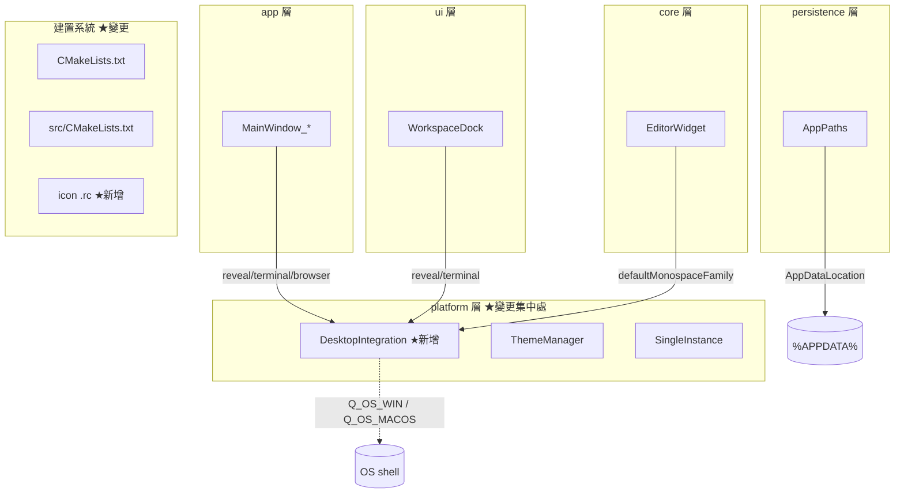
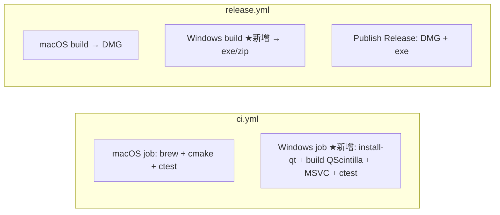

# macpad++ Windows 移植 — 系統架構 / 系統設計（SA/SD）

> **上游**：`windows_prd.md`、`windows_srs.md`
> **本文回答**：在既有分層架構下，Windows 移植的變更「放在哪一層、如何切割、模組如何互動」。

---

## 1. 架構原則

1. **平台差異下沉**：所有 OS 專屬行為集中於 `src/platform/`，上層（core/features/ui/persistence）維持平台無關。（SRS-N-002）
2. **單一抽象、雙平台實作**：以 `#ifdef Q_OS_*` 於同一函式內分流，而非拆兩份檔案。（SRS-F-008）
3. **建置條件化**：CMake 以 `if(APPLE)/elseif(WIN32)` 分流平台專屬設定，共用主體。（SRS-F-001~003）
4. **不動契約系統與品質門檻**：延續 `CLAUDE.md` §6/§10/§11。

---

## 2. 系統分層與變更定位



**變更熱點**：
- `src/platform/DesktopIntegration.{h,cpp}` — 新增（吸收所有 `open` 呼叫 + 字型選擇）
- `CMakeLists.txt`、`src/CMakeLists.txt` — 平台化
- `resources/icon/macpad.rc` + `.ico` — 新增
- `EditorWidget.cpp`、`MainWindow_*.cpp`、`WorkspaceDock.cpp` — 改呼叫抽象層
- `scripts/package_windows.ps1`、CI/Release yml — 新增/擴充

**不變**：`AppPaths`（已跨平台，僅更新註解）、`ThemeManager`、`SingleInstance`、所有 features/persistence 業務邏輯。

---

## 3. 模組設計：DesktopIntegration

### 3.1 公開介面（`DesktopIntegration.h`）

```cpp
namespace macpad::platform {
    // 在系統檔案管理器中顯示並選取指定檔案（macOS Finder / Windows Explorer）。
    void revealInFileManager(const QString &path);

    // 於指定資料夾開啟終端機（macOS Terminal / Windows Terminal 或 cmd）。
    void openInTerminal(const QString &dir);

    // 以外部應用開啟檔案；appName 空字串時交給系統預設程式。
    void openInApp(const QString &appName, const QString &path);

    // 平台預設等寬字型家族名稱（Windows: Cascadia Mono→Consolas；macOS: Menlo）。
    QString defaultMonospaceFamily();
}
```

### 3.2 行為規格（決策表）

| 函式 | macOS (`Q_OS_MACOS`) | Windows (`Q_OS_WIN`) | 其他 |
|------|----------------------|----------------------|------|
| `revealInFileManager` | `open -R <path>` | `explorer /select,<native>` | `QDesktopServices` 開啟所在目錄 |
| `openInTerminal` | `open -a Terminal <dir>` | `wt -d <dir>`，失敗→`cmd /c start cmd /k cd /d <dir>` | 無操作 |
| `openInApp` | app 空→`QDesktopServices`；否則 `open -a <app> <path>` | app 空→`QDesktopServices`；否則 `cmd /c start "" "<app>" "<path>"` | `QDesktopServices` |
| `defaultMonospaceFamily` | `"Menlo"` | 由 `QFontDatabase` 檢查 `Cascadia Mono`→`Consolas`→`Courier New` | `"Monospace"` |

### 3.3 邊界與錯誤處理
- 所有子行程以 `QProcess::startDetached(program, args_list)` 啟動（argv 陣列，SRS-N-006）。
- `explorer /select,` 的路徑必須 `QDir::toNativeSeparators`；`explorer` 對已選取檔回傳非零 exit code 屬正常，不視為錯誤。
- `defaultMonospaceFamily` 用 `QFontDatabase::families()` 判斷可用性，避免回傳系統沒有的字型。

---

## 4. 建置系統設計

### 4.1 QScintilla 定位（`CMakeLists.txt`）

```cmake
if(NOT DEFINED QSCINTILLA_ROOT)
  if(APPLE)
    execute_process(COMMAND brew --prefix qscintilla2 OUTPUT_VARIABLE QSCINTILLA_ROOT ...)
  endif()
endif()
find_path(QSCINTILLA_INCLUDE_DIR NAMES Qsci/qsciscintilla.h
  HINTS "${QSCINTILLA_ROOT}/include"
        # macOS Homebrew
        /opt/homebrew/opt/qscintilla2/include /usr/local/opt/qscintilla2/include
        # Windows：QScintilla 常安裝進 Qt 前綴，或 vcpkg
        "${_qt_prefix}/include" ${QSCINTILLA_ROOT})
find_library(QSCINTILLA_LIBRARY
  NAMES qscintilla2_qt6 libqscintilla2_qt6
  HINTS "${QSCINTILLA_ROOT}/lib" ...Homebrew... "${_qt_prefix}/lib")
```
- Windows 上，QScintilla 以原始碼 `qmake && nmake install` 安裝進 Qt 前綴（`Qsci/*.h` → `include/`，`qscintilla2_qt6.dll/.lib` → `bin/`、`lib/`），故 `_qt_prefix` HINT 即可命中。
- 錯誤訊息依平台給出對應指引（SRS-F-004）。

### 4.2 可執行檔目標（`src/CMakeLists.txt`）

```cmake
if(APPLE)
  add_executable(macpad++ MACOSX_BUNDLE app/main.cpp ${MACPAD_ICNS})
  set_target_properties(macpad++ PROPERTIES MACOSX_BUNDLE_... )
elseif(WIN32)
  add_executable(macpad++ WIN32 app/main.cpp ${CMAKE_SOURCE_DIR}/resources/icon/macpad.rc)
else()
  add_executable(macpad++ app/main.cpp)
endif()
```

### 4.3 警告旗標（`src/CMakeLists.txt`）

```cmake
if(STRICT_WARNINGS)
  if(MSVC)
    target_compile_options(macpad_lib PRIVATE /W4 /WX /permissive-)
  else()
    target_compile_options(macpad_lib PRIVATE -Wall -Wextra -Werror)
  endif()
endif()
```

### 4.4 資源與 UTF-8
- MSVC 需 `/utf-8`（原始碼含中文字面量與註解），加入全域編譯選項避免 C4819/亂碼。
- `.rc` 檔引用 `resources/icon/macpad.ico`（由既有圖示轉出多尺寸）。

---

## 5. 打包設計（`scripts/package_windows.ps1`）

```
1. 讀入版本號參數
2. cmake 設定 (Release) + 建置
3. 建 dist\macpad++\ 目錄，複製 macpad++.exe
4. windeployqt --release --no-translations? （保留 translations）macpad++.exe
   → 帶入 Qt6*.dll、platforms\qwindows.dll、styles、WebEngine（QtWebEngineProcess.exe,
     icudtl.dat, qtwebengine_*.pak, resources\, translations\qtwebengine_locales\）
5. 驗證關鍵檔存在（QtWebEngineProcess.exe、platforms\qwindows.dll）
6. （可選）Inno Setup 產生安裝檔；否則壓成 zip
7. 輸出至 dist\
```

---

## 6. CI/Release 設計



- Windows CI 用 `jurplel/install-qt-action` 安裝 Qt（含 qt5compat、qtwebengine 等模組），以 vcpkg 或快取的 QScintilla 建置。
- QScintilla 建置耗時可用 cache 加速。

---

## 7. 設計決策（Design Decisions / ADR 摘要）

| ID | 決策 | 理由 | Trade-off |
|----|------|------|-----------|
| DD-1 | 新增單一 `DesktopIntegration` 而非各處 `#ifdef` | 單一真相、易測、易加 Linux | 多一層間接 |
| DD-2 | QScintilla 以原始碼建置安裝進 Qt 前綴 | 避免 vcpkg 重建整個 Qt（含 WebEngine/Chromium） | 需一次性手動建置步驟 |
| DD-3 | Qt 以 aqt 預編譯二進位取得 | WebEngine 從源碼建置需數小時 | 綁定特定 Qt 版本 |
| DD-4 | 保留 WebEngine（不裁剪 Markdown 預覽） | 維持功能對等（PRD 非目標：不移除功能） | 封裝體積大 |
| DD-5 | 字型選擇走 `QFontDatabase` 執行期偵測 | 避免硬編不存在字型 | 極小執行期成本 |

> 依 `CLAUDE.md` §13，DD-1~DD-5 若涉及核心選型，於 `.decisions/` 建立正式 ADR。

---

## 8. 追溯（設計 ↔ SRS）

| 設計元素 | SRS |
|----------|-----|
| DesktopIntegration.revealInFileManager | F-005, F-008 |
| DesktopIntegration.openInTerminal | F-006, F-008 |
| DesktopIntegration.openInApp | F-007, F-008 |
| DesktopIntegration.defaultMonospaceFamily | F-011 |
| CMake QScintilla 分流 | F-001, F-004 |
| CMake 警告旗標分流 | F-002 |
| CMake WIN32 target + .rc | F-003 |
| AppPaths（不變） | F-009, F-010 |
| package_windows.ps1 | F-014 |
| CI/Release Windows job | F-015, F-016 |

---
*下游：詳細設計見 `windows_design.md`（逐檔 diff 級別的實作設計）。*
