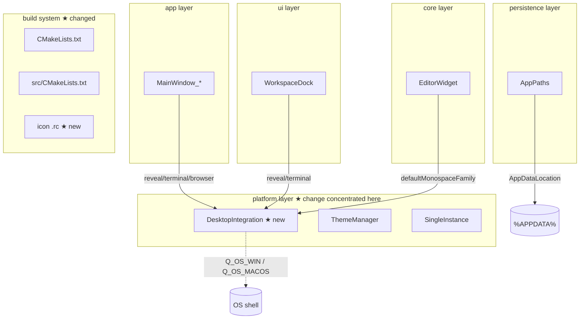
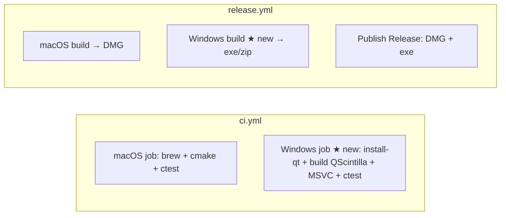

# macpad++ Windows Port — System Architecture / System Design (SA/SD)

**English** · [繁體中文](windows_sa_sd.zh-TW.md)

> **Upstream**: [`windows_prd.md`](windows_prd.md), [`windows_srs.md`](windows_srs.md)
> **This document answers**: within the existing layered architecture, *which layer* the Windows port's
> changes belong to, *how they are partitioned*, and *how the modules interact*.

---

## 1. Architectural principles

1. **Push platform differences downwards**: all OS-specific behaviour is concentrated in
   `src/platform/`; the layers above (core/features/ui/persistence) stay platform-agnostic.
   (SRS-N-002)
2. **One abstraction, two platform implementations**: branch with `#ifdef Q_OS_*` inside a single
   function rather than splitting into two files. (SRS-F-008)
3. **Conditional build**: CMake branches platform-specific settings on `if(APPLE)/elseif(WIN32)` while
   sharing the main body. (SRS-F-001–003)
4. **Do not disturb the contract system or quality gates**: `CLAUDE.md` §6/§10/§11 continue to apply.

---

## 2. Layers and where the changes land


```mermaid
flowchart TB
    subgraph app[app layer]
      MW[MainWindow_*]
    end
    subgraph ui[ui layer]
      WD[WorkspaceDock]
    end
    subgraph core[core layer]
      EW[EditorWidget]
    end
    subgraph platform[platform layer ★ change concentrated here]
      DI[DesktopIntegration ★ new]
      TM[ThemeManager]
      SI[SingleInstance]
    end
    subgraph persistence[persistence layer]
      AP[AppPaths]
    end
    subgraph build[build system ★ changed]
      CM[CMakeLists.txt]
      SCM[src/CMakeLists.txt]
      RC[icon .rc ★ new]
    end

    MW -->|reveal/terminal/browser| DI
    WD -->|reveal/terminal| DI
    EW -->|defaultMonospaceFamily| DI
    DI -. Q_OS_WIN / Q_OS_MACOS .-> OS[(OS shell)]
    AP -->|AppDataLocation| FS[(%APPDATA%)]
```

**Change hotspots**:
- `src/platform/DesktopIntegration.{h,cpp}` — new (absorbs every `open` call plus font selection)
- `CMakeLists.txt`, `src/CMakeLists.txt` — made platform-aware
- `resources/icon/macpad.rc` + `.ico` — new
- `EditorWidget.cpp`, `MainWindow_*.cpp`, `WorkspaceDock.cpp` — call the abstraction instead
- `scripts/package_windows.ps1`, CI/Release YAML — new/extended

**Unchanged**: `AppPaths` (already cross-platform; comments updated only), `ThemeManager`,
`SingleInstance`, and all features/persistence business logic.

---

## 3. Module design: DesktopIntegration

### 3.1 Public interface (`DesktopIntegration.h`)

```cpp
namespace macpad::platform {
    // Reveal and select the given file in the system file manager (macOS Finder / Windows Explorer).
    void revealInFileManager(const QString &path);

    // Open a terminal at the given folder (macOS Terminal / Windows Terminal or cmd).
    void openInTerminal(const QString &dir);

    // Open a file with an external application; an empty appName defers to the system default.
    void openInApp(const QString &appName, const QString &path);

    // Platform default monospace font family (Windows: Cascadia Mono→Consolas; macOS: Menlo).
    QString defaultMonospaceFamily();
}
```

### 3.2 Behavioural specification (decision table)

| Function | macOS (`Q_OS_MACOS`) | Windows (`Q_OS_WIN`) | Other |
|----------|----------------------|----------------------|-------|
| `revealInFileManager` | `open -R <path>` | `explorer /select,<native>` | open the containing directory via `QDesktopServices` |
| `openInTerminal` | `open -a Terminal <dir>` | `wt -d <dir>`, on failure → `cmd /c start cmd /k cd /d <dir>` | no-op |
| `openInApp` | empty app → `QDesktopServices`; otherwise `open -a <app> <path>` | empty app → `QDesktopServices`; otherwise `cmd /c start "" "<app>" "<path>"` | `QDesktopServices` |
| `defaultMonospaceFamily` | `"Menlo"` | check `Cascadia Mono`→`Consolas`→`Courier New` via `QFontDatabase` | `"Monospace"` |

### 3.3 Boundaries and error handling
- All child processes are launched with `QProcess::startDetached(program, args_list)` (argv array,
  SRS-N-006).
- The path passed to `explorer /select,` must go through `QDir::toNativeSeparators`; `explorer`
  returning a non-zero exit code after selecting a file is normal and is not treated as an error.
- `defaultMonospaceFamily` checks availability via `QFontDatabase::families()` so it never returns a
  font the system does not have.

---

## 4. Build system design

### 4.1 Locating QScintilla (`CMakeLists.txt`)

```cmake
if(NOT DEFINED QSCINTILLA_ROOT)
  if(APPLE)
    execute_process(COMMAND brew --prefix qscintilla2 OUTPUT_VARIABLE QSCINTILLA_ROOT ...)
  endif()
endif()
find_path(QSCINTILLA_INCLUDE_DIR NAMES Qsci/qsciscintilla.h
  HINTS "${QSCINTILLA_ROOT}/include"
        # macOS Homebrew
        /opt/homebrew/opt/qscintilla2/include /usr/local/opt/qscintilla2/include
        # Windows: QScintilla is usually installed into the Qt prefix, or via vcpkg
        "${_qt_prefix}/include" ${QSCINTILLA_ROOT})
find_library(QSCINTILLA_LIBRARY
  NAMES qscintilla2_qt6 libqscintilla2_qt6
  HINTS "${QSCINTILLA_ROOT}/lib" ...Homebrew... "${_qt_prefix}/lib")
```
- On Windows, QScintilla is installed into the Qt prefix from source via `qmake && nmake install`
  (`Qsci/*.h` → `include/`, `qscintilla2_qt6.dll/.lib` → `bin/` and `lib/`), so the `_qt_prefix` HINT
  is enough to find it.
- Error messages give platform-appropriate guidance (SRS-F-004).

### 4.2 Executable target (`src/CMakeLists.txt`)

```cmake
if(APPLE)
  add_executable(macpad++ MACOSX_BUNDLE app/main.cpp ${MACPAD_ICNS})
  set_target_properties(macpad++ PROPERTIES MACOSX_BUNDLE_... )
elseif(WIN32)
  add_executable(macpad++ WIN32 app/main.cpp ${CMAKE_SOURCE_DIR}/resources/icon/macpad.rc)
else()
  add_executable(macpad++ app/main.cpp)
endif()
```

### 4.3 Warning flags (`src/CMakeLists.txt`)

```cmake
if(STRICT_WARNINGS)
  if(MSVC)
    target_compile_options(macpad_lib PRIVATE /W4 /WX /permissive-)
  else()
    target_compile_options(macpad_lib PRIVATE -Wall -Wextra -Werror)
  endif()
endif()
```

### 4.4 Resources and UTF-8
- MSVC needs `/utf-8` (the sources contain Chinese literals and comments); it is added as a global
  compile option to avoid C4819 and mojibake.
- The `.rc` file references `resources/icon/macpad.ico` (multi-size, generated from the existing icon).

---

## 5. Packaging design (`scripts/package_windows.ps1`)

```
1. Read the version argument
2. cmake configure (Release) + build
3. Create dist\macpad++\ and copy macpad++.exe into it
4. windeployqt --release (translations retained) macpad++.exe
   → brings in Qt6*.dll, platforms\qwindows.dll, styles, WebEngine (QtWebEngineProcess.exe,
     icudtl.dat, qtwebengine_*.pak, resources\, translations\qtwebengine_locales\)
5. Verify the critical files exist (QtWebEngineProcess.exe, platforms\qwindows.dll)
6. (Optional) produce an installer with Inno Setup; otherwise compress to a zip
7. Emit to dist\
```

---

## 6. CI/Release design


```mermaid
flowchart LR
    subgraph ci[ci.yml]
      m[macOS job: brew + cmake + ctest]
      w[Windows job ★ new: install-qt + build QScintilla + MSVC + ctest]
    end
    subgraph rel[release.yml]
      mb[macOS build → DMG]
      wb[Windows build ★ new → exe/zip]
      pub[Publish Release: DMG + exe]
    end
```

- Windows CI installs Qt with `jurplel/install-qt-action` (including the qt5compat, qtwebengine and
  other modules), building against vcpkg or a cached QScintilla.
- The QScintilla build is slow and can be accelerated with a cache.

---

## 7. Design decisions (ADR summary)

| ID | Decision | Rationale | Trade-off |
|----|----------|-----------|-----------|
| DD-1 | A single new `DesktopIntegration` rather than `#ifdef` scattered everywhere | Single source of truth, testable, easy to add Linux | One more layer of indirection |
| DD-2 | Build QScintilla from source into the Qt prefix | Avoids vcpkg rebuilding the whole of Qt (including WebEngine/Chromium) | Requires a one-off manual build step |
| DD-3 | Obtain Qt as aqt prebuilt binaries | Building WebEngine from source takes hours | Pins a specific Qt version |
| DD-4 | Keep WebEngine (do not drop Markdown preview) | Maintains feature parity (a PRD non-goal: do not remove functionality) | Large package size |
| DD-5 | Font selection via runtime `QFontDatabase` detection | Avoids hard-coding a font that may not exist | Negligible runtime cost |

> Per `CLAUDE.md` §13, where DD-1–DD-5 involve core technology selection, a formal ADR is created
> under `.decisions/`.

---

## 8. Traceability (design ↔ SRS)

| Design element | SRS |
|----------------|-----|
| DesktopIntegration.revealInFileManager | F-005, F-008 |
| DesktopIntegration.openInTerminal | F-006, F-008 |
| DesktopIntegration.openInApp | F-007, F-008 |
| DesktopIntegration.defaultMonospaceFamily | F-011 |
| CMake QScintilla branching | F-001, F-004 |
| CMake warning-flag branching | F-002 |
| CMake WIN32 target + .rc | F-003 |
| AppPaths (unchanged) | F-009, F-010 |
| package_windows.ps1 | F-014 |
| CI/Release Windows job | F-015, F-016 |

---
*Downstream: the detailed design is in [`windows_design.md`](windows_design.md) (implementation design
at diff-per-file granularity).*
